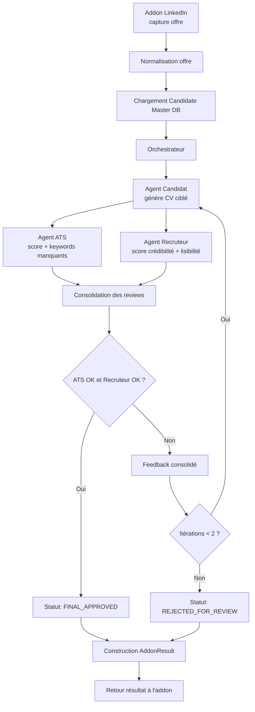

# Spécification POC - Moteur IA multi-agents pour génération de CV

## 1. Objectif

Construire un POC simple capable de :

1. lire une offre d'emploi LinkedIn via un addon/browser extension ;
2. normaliser les données de l'offre ;
3. générer un CV ciblé à partir d'une base master candidat (gros JSON) ;
4. faire valider ce CV par 2 agents d'évaluation :
   - un agent ATS ;
   - un agent Recruteur ;
5. produire un CV final uniquement si les 2 agents évaluateurs sont d'accord.
6. retourner à l'addon un résultat standardisé, que le CV soit accepté ou rejeté.

Le système doit rester très simple pour une demo.

## 2. Périmètre du POC

### Inclus

- Une offre d'emploi à la fois
- Une base master candidat au format JSON
- Trois agents logiques :
  - `Candidat` : génération du CV
  - `ATS` : validation machine
  - `Recruteur` : validation humaine
- Un orchestrateur simple pour chaîner les agents
- Un maximum de 2 boucles de révision avant échec

### Hors périmètre

- Multi-utilisateur
- Historique complet de versions du CV
- UI avancée
- Connexion temps réel à plusieurs job boards

## 3. Vue d'ensemble de l'architecture

### Composants

1. `LinkedIn Job Reader Addon`
   - Lit la page LinkedIn
   - Extrait les données brutes de l'offre
   - Envoie un JSON d'offre normalisé au backend

2. `Candidate Master DB`
   - Gros JSON source de vérité du candidat
   - Contient expériences, compétences, preuves, formations, langues, certifications

3. `Orchestrateur`
   - Lance les agents dans le bon ordre
   - Gère les statuts
   - Gère les révisions
   - Décide si le CV final est accepté ou rejeté

4. `Agent Candidat`
   - Produit un CV ciblé à partir de l'offre + DB master

5. `Agent ATS`
   - Évalue l'alignement ATS
   - Signale les mots-clés manquants et les hard filters non couverts

6. `Agent Recruteur`
   - Évalue la crédibilité humaine du CV
   - Vérifie lisibilité, cohérence et preuves d'expérience

### Flux global

Le flux global du POC est le suivant :

1. l'addon lit une offre LinkedIn et envoie les données brutes ;
2. le backend normalise l'offre en `JobOfferNormalized` ;
3. l'orchestrateur charge la `CandidateMasterProfile` ;
4. l'agent `Candidat` génère un `GeneratedCV` ciblé ;
5. les agents `ATS` et `Recruteur` évaluent le CV en parallèle ;
6. l'orchestrateur consolide les retours et relance une révision si nécessaire ;
7. le système décide `FINAL_APPROVED` ou `REJECTED_FOR_REVIEW` ;
8. le backend retourne un `AddonResult` standardisé à l'addon.

Résumé en une ligne :

```text
Addon LinkedIn -> Normalisation offre -> Chargement master DB -> Génération CV -> Review ATS + Recruteur -> Décision finale -> Retour résultat addon
```

## 4. Hypothèse MCP

Pour ce POC, `MCP` est optionnel.

Recommandation simple :

- garder 3 agents logiques avec des contrats d'entrée/sortie clairs ;
- considérer `ATS` et `Recruteur` comme les 2 agents dont l'accord déclenche la validation finale ;
- exposer chaque agent plus tard comme un outil MCP si besoin ;
- commencer avec un orchestrateur backend classique.

Si vous voulez une implémentation MCP plus tard, chaque agent peut être exposé comme une tool/action :

- `generate_targeted_cv`
- `score_cv_for_ats`
- `review_cv_as_recruiter`

## 5. Modélisation des données

Le POC repose sur 8 objets principaux.

### 5.1 JobOfferRaw

Données brutes capturées par l'addon.

```json
{
  "source": "linkedin",
  "source_url": "https://linkedin.com/jobs/view/123",
  "captured_at": "2026-03-28T10:00:00Z",
  "html_snapshot_ref": "optional",
  "raw_text": "full text extracted from page",
  "raw_fields": {
    "title": "Senior Product Designer",
    "company": "Acme",
    "location": "Paris",
    "employment_type": "Full-time"
  }
}
```

### 5.2 JobOfferNormalized

Format canonique utilisé par les agents.

```json
{
  "job_id": "job_123",
  "source": "linkedin",
  "source_url": "https://linkedin.com/jobs/view/123",
  "title": "Senior Product Designer",
  "company": "Acme",
  "location": "Paris",
  "remote_mode": "hybrid",
  "employment_type": "full_time",
  "seniority": "senior",
  "job_summary": "Short normalized summary",
  "responsibilities": ["Lead design discovery", "Ship product flows"],
  "requirements_must_have": ["Figma", "Design systems", "5+ years experience"],
  "requirements_nice_to_have": ["B2B SaaS", "User research"],
  "keywords": ["product design", "figma", "design system", "ux", "stakeholder management"],
  "tools": ["Figma", "Notion"],
  "languages": ["French", "English"],
  "years_experience_min": 5
}
```

### 5.3 CandidateMasterProfile

Base master JSON du candidat. Source unique pour générer des CV adaptés.

```json
{
  "candidate_id": "cand_001",
  "identity": {
    "full_name": "Jane Doe",
    "headline": "Product Designer",
    "email": "jane@example.com",
    "phone": "+33...",
    "location": "Paris",
    "links": {
      "linkedin": "https://linkedin.com/in/janedoe",
      "portfolio": "https://janedoe.com"
    }
  },
  "target_roles": ["Senior Product Designer", "Lead Product Designer"],
  "professional_summary_master": "Master summary",
  "skills": [
    {
      "name": "Figma",
      "category": "tool",
      "level": "advanced",
      "years": 6,
      "evidence_refs": ["exp_01", "proj_03"]
    }
  ],
  "experiences": [
    {
      "experience_id": "exp_01",
      "company": "Company A",
      "title": "Product Designer",
      "start_date": "2021-01",
      "end_date": "2024-02",
      "location": "Paris",
      "summary": "Owned core journeys",
      "achievements": [
        {
          "text": "Improved activation by 18%",
          "metric": "18%",
          "proof_level": "strong"
        }
      ],
      "skills_used": ["Figma", "Design System", "UX Research"]
    }
  ],
  "education": [
    {
      "school": "School X",
      "degree": "Master in Design",
      "year": "2020"
    }
  ],
  "certifications": [],
  "languages": [
    {
      "name": "French",
      "level": "native"
    },
    {
      "name": "English",
      "level": "professional"
    }
  ],
  "constraints": {
    "must_not_claim": ["Team management if not proven"],
    "preferred_cv_language": "fr",
    "max_cv_pages": 1
  },
  "free_text_notes": "Optional recruiter-facing notes stored in master profile"
}
```

### 5.4 GeneratedCV

CV ciblé généré par l'agent Candidat.

```json
{
  "cv_id": "cv_001",
  "candidate_id": "cand_001",
  "job_id": "job_123",
  "version": 1,
  "language": "fr",
  "title": "CV ciblé - Senior Product Designer",
  "header": {
    "full_name": "Jane Doe",
    "headline": "Senior Product Designer",
    "contact": {
      "email": "jane@example.com",
      "phone": "+33..."
    },
    "links": {
      "linkedin": "https://linkedin.com/in/janedoe",
      "portfolio": "https://janedoe.com"
    }
  },
  "summary": "Tailored summary for the job",
  "skills_highlighted": ["Figma", "Design System", "UX Research"],
  "experiences_selected": [
    {
      "experience_id": "exp_01",
      "rewritten_bullets": [
        "Led redesign of onboarding and improved activation by 18%"
      ]
    }
  ],
  "education_selected": [],
  "certifications_selected": [],
  "keywords_covered": ["figma", "design system", "ux"],
  "omitted_items": ["Unrelated internship"],
  "generation_notes": [
    "Focused on B2B SaaS evidence",
    "Avoided unsupported leadership claims"
  ]
}
```

### 5.5 ATSReview

Sortie de l'agent ATS.

```json
{
  "review_id": "ats_001",
  "cv_id": "cv_001",
  "job_id": "job_123",
  "score": 82,
  "passed": true,
  "hard_filters_status": [
    {
      "filter": "5+ years experience",
      "status": "pass",
      "evidence": "Experience timeline covers 6 years"
    }
  ],
  "matched_keywords": ["figma", "design system", "ux research"],
  "missing_keywords": ["stakeholder management"],
  "format_flags": [],
  "recommendations": [
    "Add explicit stakeholder management wording in summary or experience"
  ]
}
```

### 5.6 RecruiterReview

Sortie de l'agent Recruteur.

```json
{
  "review_id": "rec_001",
  "cv_id": "cv_001",
  "job_id": "job_123",
  "score": 78,
  "passed": true,
  "readability_score": 80,
  "credibility_score": 76,
  "coherence_score": 79,
  "evidence_score": 77,
  "strengths": [
    "Strong quantified impact",
    "Experience sequence is coherent"
  ],
  "concerns": [
    "Summary slightly generic"
  ],
  "recommendations": [
    "Make the opening summary more specific to B2B SaaS context"
  ]
}
```

### 5.7 ReviewAgreement

Objet de décision finale porté par l'orchestrateur.

```json
{
  "job_id": "job_123",
  "cv_id": "cv_001",
  "cv_generation_ok": true,
  "ats_ok": true,
  "recruiter_ok": true,
  "review_agreement_ok": true,
  "final_status": "FINAL_APPROVED",
  "rejection_reasons": [],
  "iteration_count": 1
}
```

### 5.8 AddonResult

Objet de réponse retourné à l'addon, quel que soit le résultat final.

```json
{
  "job_id": "job_123",
  "cv_id": "cv_001",
  "status": "accepted",
  "overall_score": 80,
  "scores": {
    "ats_score": 82,
    "recruiter_score": 78
  },
  "strengths": [
    "Good keyword coverage for the target job",
    "Strong quantified experience evidence"
  ],
  "weaknesses": [
    "Stakeholder management not explicit enough",
    "Summary is still slightly generic"
  ],
  "recommendations": [
    "Add stakeholder management wording in one experience bullet",
    "Make the summary more specific to the target company context"
  ],
  "returned_at": "2026-03-28T10:05:00Z"
}
```

## 6. Contrats d'entrée / sortie par agent

## 6.1 Agent Candidat

### Rôle

Créer le CV ciblé le plus pertinent à partir de l'offre et de la base master candidat.

### Input

```json
{
  "job_offer": "JobOfferNormalized",
  "candidate_master_profile": "CandidateMasterProfile",
  "generation_rules": {
    "language": "fr",
    "max_pages": 1,
    "tone": "professional",
    "truthfulness_mode": "strict"
  },
  "revision_context": {
    "previous_ats_review": "optional",
    "previous_recruiter_review": "optional"
  }
}
```

### Output

```json
{
  "generated_cv": "GeneratedCV",
  "coverage_map": {
    "matched_requirements": [
      {
        "requirement": "Design systems",
        "evidence_ref": "exp_01"
      }
    ],
    "uncovered_requirements": ["Stakeholder management"]
  },
  "self_check": {
    "unsupported_claims_found": false,
    "warnings": []
  }
}
```

### Règles métier

- Ne jamais inventer une expérience ou une compétence.
- Prioriser les éléments prouvés par la DB master.
- Optimiser le CV pour l'offre ciblée sans casser la cohérence globale du parcours.

## 6.2 Agent ATS

### Rôle

Mesurer la compatibilité machine/ATS entre le CV généré et l'offre.

### Input

```json
{
  "job_offer": "JobOfferNormalized",
  "generated_cv": "GeneratedCV",
  "scoring_rules": {
    "passing_score": 75,
    "weight_keywords": 0.5,
    "weight_hard_filters": 0.3,
    "weight_structure": 0.2
  }
}
```

### Output

```json
{
  "ats_review": "ATSReview",
  "decision": {
    "status": "pass",
    "blocking_issues": []
  }
}
```

### Critères simples POC

- présence des mots-clés importants ;
- couverture des hard filters ;
- clarté des intitulés ;
- absence de formulations trop vagues sur les compétences clés.

## 6.3 Agent Recruteur

### Rôle

Évaluer si le CV paraît crédible, lisible et convaincant pour un humain.

### Input

```json
{
  "job_offer": "JobOfferNormalized",
  "generated_cv": "GeneratedCV",
  "review_rules": {
    "passing_score": 75,
    "weight_readability": 0.25,
    "weight_credibility": 0.35,
    "weight_evidence": 0.2,
    "weight_coherence": 0.2
  }
}
```

### Output

```json
{
  "recruiter_review": "RecruiterReview",
  "decision": {
    "status": "pass",
    "blocking_issues": []
  }
}
```

### Critères simples POC

- lisibilité du CV ;
- cohérence entre le poste visé et le parcours ;
- niveau de preuve concret ;
- absence de sur-promesse ;
- équilibre entre densité et clarté.

## 7. Orchestration et workflow

### Logique de décision

Le CV final est validé si :

- l'agent Candidat a généré un CV exploitable ;
- le score ATS est supérieur ou égal au seuil ;
- le score Recruteur est supérieur ou égal au seuil ;
- aucun agent de review ne remonte de `blocking_issue`.

L'accord final porte uniquement sur les 2 agents évaluateurs : `ATS` et `Recruteur`.

Traduction dans l'objet `ReviewAgreement` :

- `cv_generation_ok = true`
- `ats_ok = true`
- `recruiter_ok = true`
- `review_agreement_ok = true`
- `final_status = FINAL_APPROVED`

### Politique de révision

- Si `ATS` échoue, retour vers `Candidat` avec feedback ATS.
- Si `Recruteur` échoue, retour vers `Candidat` avec feedback Recruteur.
- Si les deux échouent, retour unique vers `Candidat` avec feedback consolidé.
- Maximum `2` itérations de correction.
- Après 2 échecs, le workflow se termine en `REJECTED_FOR_REVIEW`.

### Retour à l'addon

Quel que soit le résultat final, l'orchestrateur retourne un objet `AddonResult` à l'addon avec :

- un `status` final : `accepted` ou `rejected` ;
- un `overall_score` ;
- les scores détaillés ATS et Recruteur ;
- les `strengths` ;
- les `weaknesses` ;
- les `recommendations`.

## 8. Mermaid chart



## 9. États de workflow

```json
{
  "workflow_status": [
    "JOB_IMPORTED",
    "JOB_NORMALIZED",
    "CV_GENERATED",
    "ATS_REVIEWED",
    "RECRUITER_REVIEWED",
    "REVISION_REQUESTED",
    "FINAL_APPROVED",
    "REJECTED_FOR_REVIEW",
    "RESULT_SENT_TO_ADDON"
  ]
}
```

## 10. Contrat d'orchestration minimal

### Input global

```json
{
  "job_offer_raw": "JobOfferRaw",
  "candidate_id": "cand_001"
}
```

### Output global

```json
{
  "status": "FINAL_APPROVED",
  "job_offer": "JobOfferNormalized",
  "generated_cv": "GeneratedCV",
  "ats_review": "ATSReview",
  "recruiter_review": "RecruiterReview",
  "review_agreement": "ReviewAgreement",
  "addon_result": "AddonResult",
  "iterations": 1
}
```

### Mapping de statut pour l'addon

```json
{
  "status_mapping": {
    "FINAL_APPROVED": "accepted",
    "REJECTED_FOR_REVIEW": "rejected"
  }
}
```

## 11. Règles de scoring proposées pour le POC

### Agent ATS

- `0-49` : faible matching
- `50-74` : partiellement compatible
- `75-100` : acceptable pour le POC

Formule simple :

```text
ATS Score = 50% keywords + 30% hard filters + 20% structure
```

### Agent Recruteur

- `0-49` : faible crédibilité
- `50-74` : crédible mais faible
- `75-100` : acceptable pour le POC

Formule simple :

```text
Recruiter Score = 35% crédibilité + 25% lisibilité + 20% cohérence + 20% preuves
```

## 12. Principes produit à garder

- La DB master est la source de vérité.
- Le CV généré doit être personnalisé, mais jamais mensonger.
- L'agent ATS optimise pour le matching machine.
- L'agent Recruteur protège la qualité perçue par un humain.
- Le résultat final n'est livré que si `ATS` et `Recruteur` convergent.

## 13. MVP technique recommandé

Pour aller vite sur ce POC :

1. un backend avec un orchestrateur unique ;
2. un stockage JSON pour la master DB ;
3. une sortie JSON + HTML/Markdown du CV ;
4. des agents implémentés comme 3 services ou 3 prompts séparés ;
5. une logique de seuil simple et explicable.
