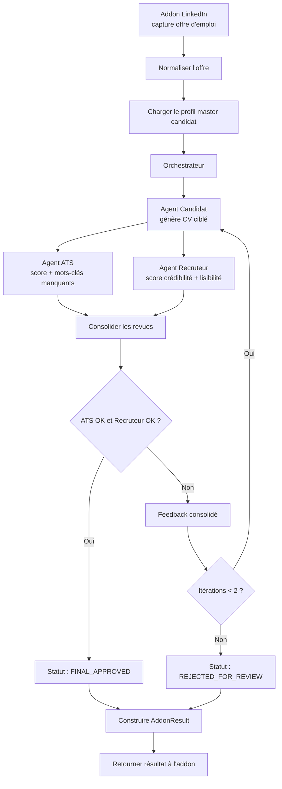

# Conception Backend — DreamJob

## Vue d'ensemble

DreamJob aide les utilisateurs à adapter leur CV aux offres d'emploi LinkedIn. Ce document décrit l'architecture backend pour la démo open-source mono-utilisateur.

**Objectifs :** friction minimale à l'installation (`git clone && npm install && npm run dev`), pas d'authentification, local-first.

---

## Stack technique

| Couche     | Choix                   | Pourquoi                                    |
| ---------- | ----------------------- | ------------------------------------------- |
| Runtime    | Node.js + TypeScript    | Largement connu, excellent outillage        |
| Framework  | Fastify                 | Rapide, basé sur les plugins, support TS natif |
| Stockage    | Fichiers JSON (`fs`) | Zéro configuration — juste des fichiers, pas d'ORM ni de BDD nécessaire |
| IA         | OpenAI API              | Alimente toutes les opérations des agents IA |
| PDF Parse  | `pdf-parse`             | Extraction de texte PDF — JS pur, pas de dépendances natives |
| Upload     | `@fastify/multipart`    | Gestion de l'upload de fichiers pour Fastify |

---

## Modèles de données

Tous les modèles utilisent des IDs string auto-générés (ex. `"job_1"`, `"cv_1"`) et des horodatages `createdAt`/`updatedAt` au format ISO-8601. Chaque type de modèle est stocké dans son propre fichier JSON dans le répertoire `data/`.

### Profile

Document unique représentant l'identité professionnelle complète de l'utilisateur (CandidateMasterProfile). Stocké dans `data/profile.json`. Récupéré et mis à jour en bloc via `GET` / `PUT /api/profile`.

| Champ | Type | Notes                                    |
| ----- | ---- | ---------------------------------------- |
| id    | String | Toujours `"default"` (utilisateur unique)  |
| data  | Object | CandidateMasterProfile complet — voir ci-dessous |

#### Structure JSON du profil

```json
{
  "identity": {
    "name": "Jane Doe",
    "headline": "Product Designer",
    "email": "jane@example.com",
    "phone": "+33...",
    "location": "Paris",
    "links": {
      "linkedin": "https://linkedin.com/in/janedoe",
      "portfolio": "https://janedoe.com",
      "github": "https://github.com/janedoe"
    }
  },
  "targetRoles": ["Senior Product Designer", "Lead Product Designer"],
  "professionalSummaryMaster": "Master summary text",
  "experiences": [
    {
      "experienceId": "exp_01",
      "title": "Product Designer",
      "company": "Company A",
      "location": "Paris",
      "startDate": "2021-01",
      "endDate": "2024-02",
      "description": "Owned core journeys",
      "achievements": [
        { "text": "Improved activation by 18%", "metric": "18%", "proofLevel": "strong" }
      ],
      "skillsUsed": ["Figma", "Design System", "UX Research"]
    }
  ],
  "education": [
    {
      "school": "School X",
      "degree": "Master in Design",
      "field": "Design",
      "year": "2020"
    }
  ],
  "skills": [
    {
      "name": "Figma",
      "category": "tool",
      "level": "advanced",
      "years": 6,
      "evidenceRefs": ["exp_01", "proj_03"]
    }
  ],
  "certifications": [
    {
      "name": "AWS Solutions Architect",
      "issuer": "Amazon",
      "date": "2023-06"
    }
  ],
  "languages": [
    { "name": "French", "level": "native" },
    { "name": "English", "level": "professional" }
  ],
  "projects": [
    {
      "name": "Portfolio Site",
      "description": "Personal portfolio",
      "url": "https://janedoe.com",
      "technologies": ["React", "Next.js"]
    }
  ],
  "references": [
    {
      "name": "John Smith",
      "title": "Engineering Manager",
      "company": "Company A",
      "email": "john@example.com",
      "phone": "+33...",
      "relationship": "Former Manager"
    }
  ],
  "constraints": {
    "preferredCvLanguage": "fr",
    "maxCvPages": 1,
    "mustNotClaim": ["Team management if not proven"]
  }
}
```

### ResumeUpload

Suit le cycle de vie du CV PDF uploadé et de son extraction. Stocké dans `data/resume-upload.json`. Document unique (un seul CV à la fois pour la v1).

| Champ            | Type     | Notes                                    |
| ---------------- | -------- | ---------------------------------------- |
| id               | String   | Toujours `"default"` (utilisateur unique) |
| originalFilename | String   | ex. `"jane_resume.pdf"`                  |
| storagePath      | String   | `"data/uploads/resume.pdf"`              |
| uploadedAt       | DateTime | ISO-8601                                 |
| status           | String   | `uploaded` / `extracting` / `extracted` / `confirmed` / `failed` |
| error            | String?  | Message d'erreur si le statut est `failed` |

### ExtractionResult

Sortie structurée du pipeline d'extraction IA. Stocké dans `data/extraction.json`. Document unique.

| Champ          | Type     | Notes                                    |
| -------------- | -------- | ---------------------------------------- |
| id             | String   | Toujours `"default"`                     |
| resumeUploadId | String   | Réf → id ResumeUpload                    |
| extractedAt    | DateTime | ISO-8601                                 |
| rawText        | String   | Texte brut extrait du PDF (pour le débogage) |
| data           | Object   | Même structure que Profile `data` — le brouillon extrait |
| confidence     | Object   | Miroir de la structure Profile avec scores de confiance par champ |
| reviewStatus   | Object   | Suivi de la revue par section/élément    |

#### Structure de la carte de confiance

L'objet confidence reproduit la structure `data` du Profile, mais chaque champ terminal est remplacé par une entrée de confiance :

```json
{
  "identity": {
    "name": { "score": 0.95, "source": "extracted" },
    "headline": { "score": 0.7, "source": "inferred" },
    "email": { "score": 0.99, "source": "extracted" },
    "phone": { "score": 0.6, "source": "extracted" },
    "location": { "score": 0.8, "source": "extracted" }
  },
  "experiences": [
    {
      "_overall": 0.85,
      "title": { "score": 0.95 },
      "company": { "score": 0.95 },
      "startDate": { "score": 0.7 },
      "endDate": { "score": 0.6 },
      "achievements": [
        { "text": { "score": 0.8 } }
      ]
    }
  ],
  "education": [],
  "skills": []
}
```

- **score** : 0.0–1.0. Les champs en dessous de 0.7 sont « faible confiance » et mis en évidence dans l'interface.
- **source** : `"extracted"` (trouvé littéralement dans le texte), `"inferred"` (déduit par l'IA), `"missing"` (non trouvé, deviné par l'IA ou laissé vide).

#### Structure du statut de revue

Suit quelles sections et quels éléments l'utilisateur a révisés. Une section est « résolue » uniquement quand tous ses éléments ont `reviewed: true`.

```json
{
  "identity": { "reviewed": false },
  "experiences": [
    { "experienceId": "exp_01", "reviewed": false }
  ],
  "education": [
    { "index": 0, "reviewed": false }
  ],
  "skills": [
    { "name": "Figma", "reviewed": false }
  ],
  "completionStatus": {
    "markedComplete": false,
    "markedCompleteAt": null
  }
}
```

---

### JobOfferRaw

Données brutes capturées par l'extension navigateur avant la normalisation IA.

| Champ            | Type     | Notes                                      |
| ---------------- | -------- | ------------------------------------------ |
| id               | String   | ex. `"raw_1"`                              |
| source           | String   | ex. "linkedin"                             |
| sourceUrl        | String   | URL originale de l'offre d'emploi          |
| capturedAt       | DateTime | Date de capture par l'extension            |
| htmlSnapshotRef  | String   | Optionnel — réf. vers le snapshot HTML stocké |
| rawText          | String   | Texte complet extrait de la page           |
| rawFields        | Object   | `{title, company, location, employment_type, ...}` |

### JobPost

Offre d'emploi normalisée créée à partir des données brutes. Utilisée par les agents IA.

| Champ                | Type     | Notes                                      |
| -------------------- | -------- | ------------------------------------------ |
| id                   | String   | ex. `"job_1"`                              |
| jobOfferRawId        | String   | Réf → id JobOfferRaw                       |
| title                | String   | Intitulé du poste                          |
| company              | String   |                                            |
| description          | String   | Texte complet de la description du poste   |
| url                  | String   | URL de l'offre LinkedIn                    |
| salary               | String   | Optionnel, tel que publié                  |
| location             | String   |                                            |
| remoteMode           | String   | `onsite` / `hybrid` / `remote`             |
| employmentType       | String   | `full_time` / `part_time` / `contract` / `internship` |
| seniority            | String   | `entry` / `mid` / `senior` / `lead` / `executive` |
| jobSummary           | String   | Résumé normalisé court                     |
| responsibilities     | String[] | Responsabilités clés        |
| requirementsMustHave | String[] | Exigences obligatoires      |
| requirementsNiceToHave | String[] | Exigences souhaitées      |
| keywords             | String[] | Mots-clés extraits          |
| tools                | String[] | Outils mentionnés           |
| languages            | String[] | Langues requises            |
| yearsExperienceMin   | Int      | Optionnel                                  |
| postedDate           | DateTime | Optionnel                                  |

### GeneratedCV

CV structuré et ciblé pour un poste, généré par l'Agent Candidat.

| Champ                  | Type     | Notes                                              |
| ---------------------- | -------- | -------------------------------------------------- |
| id                     | String   | ex. `"cv_1"`                                       |
| profileId              | String   | Réf → id Profile                                   |
| jobPostId              | String   | Réf → id JobPost                                   |
| version                | Int      | Compteur d'itérations                              |
| language               | String   | Langue du CV (ex. "fr", "en")                      |
| title                  | String   | ex. "CV ciblé - Senior Product Designer"           |
| header                 | Object   | `{fullName, headline, contact, links}`             |
| summary                | String   | Résumé professionnel adapté                        |
| skillsHighlighted      | String[] | Compétences sélectionnées pour ce poste |
| experiencesSelected    | Object[] | `[{experienceId, rewrittenBullets[]}]`             |
| educationSelected      | Object[] | Entrées de formation sélectionnées                 |
| certificationsSelected | Object[] | Certifications sélectionnées                       |
| keywordsCovered        | String[] | Mots-clés du poste couverts         |
| omittedItems           | String[] | Éléments délibérément exclus        |
| generationNotes        | String[] | Notes de raisonnement de l'agent    |

### ATSReview

Sortie de l'Agent ATS — vérification de la conformité des mots-clés et du format.

| Champ             | Type     | Notes                                      |
| ----------------- | -------- | ------------------------------------------ |
| id                | String   | ex. `"ats_1"`                              |
| cvId              | String   | Réf → id GeneratedCV                       |
| jobPostId         | String   | Réf → id JobPost                           |
| score             | Int      | 0–100                                      |
| passed            | Boolean  |                                            |
| hardFiltersStatus | Object[] | `[{filter, status, evidence}]`             |
| matchedKeywords   | String[] | Mots-clés trouvés dans le CV |
| missingKeywords   | String[] | Mots-clés absents du CV     |
| formatFlags       | String[] | Problèmes de mise en forme  |
| recommendations   | String[] | Améliorations suggérées     |

### RecruiterReview

Sortie de l'Agent Recruteur — vérification de la lisibilité et de la crédibilité.

| Champ            | Type     | Notes                              |
| ---------------- | -------- | ---------------------------------- |
| id               | String   | ex. `"rr_1"`                       |
| cvId             | String   | Réf → id GeneratedCV               |
| jobPostId        | String   | Réf → id JobPost                   |
| score            | Int      | Score global 0–100                 |
| passed           | Boolean  |                                    |
| readabilityScore | Int      | 0–100                              |
| credibilityScore | Int      | 0–100                              |
| coherenceScore   | Int      | 0–100                              |
| evidenceScore    | Int      | 0–100                              |
| strengths        | String[] | Points forts        |
| concerns         | String[] | Problèmes identifiés |
| recommendations  | String[] | Améliorations suggérées |

### ReviewAgreement

Objet de décision finale de l'orchestrateur.

| Champ              | Type     | Notes                                                |
| ------------------ | -------- | ---------------------------------------------------- |
| id                 | String   | ex. `"ra_1"`                                         |
| jobPostId          | String   | Réf → id JobPost                                     |
| cvId               | String   | Réf → id GeneratedCV                                 |
| cvGenerationOk     | Boolean  |                                                      |
| atsOk              | Boolean  |                                                      |
| recruiterOk        | Boolean  |                                                      |
| reviewAgreementOk  | Boolean  |                                                      |
| finalStatus        | String   | `FINAL_APPROVED` / `REJECTED` / `NEEDS_REVISION`    |
| rejectionReasons   | String[] | Raisons du rejet                      |
| iterationCount     | Int      |                                                      |

---

## Routes API

Chemin de base : `/api`

### Profile

| Méthode | Route            | Description                              |
| ------- | ---------------- | ---------------------------------------- |
| GET     | `/api/profile`   | Récupérer le document profil complet     |
| PUT     | `/api/profile`   | Remplacer le document profil complet     |

### Upload et extraction de CV

| Méthode | Route                            | Description                                              |
| ------- | -------------------------------- | -------------------------------------------------------- |
| POST    | `/api/resume/upload`             | Upload PDF (multipart), stockage et déclenchement de l'extraction |
| GET     | `/api/resume/status`             | Obtenir le statut de l'upload + extraction               |
| GET     | `/api/resume/extraction`         | Obtenir le résultat d'extraction avec confiance + statut de revue |
| POST    | `/api/resume/extraction/confirm` | Écrire les données extraites dans le Profile, marquer comme confirmé |
| PUT     | `/api/resume/extraction/review`  | Mettre à jour le statut de revue d'une section/élément   |
| GET     | `/api/resume/completeness`       | Calculé : progression %, score de qualité, checklist     |

**POST `/api/resume/upload`** — accepte `multipart/form-data` avec un seul champ `file`. Valide PDF uniquement, max 10 Mo. Stocke le PDF dans `data/uploads/resume.pdf`. Exécute l'extraction de manière synchrone. Retourne `{ id, status, extractedData }`.

**GET `/api/resume/status`** — retourne le document ResumeUpload actuel (statut, horodatages, erreur le cas échéant).

**GET `/api/resume/extraction`** — retourne le résultat d'extraction complet : données extraites, carte de confiance et statut de revue. 404 si aucune extraction n'existe.

**POST `/api/resume/extraction/confirm`** — copie `ExtractionResult.data` dans `data/profile.json` comme Profile. Met à jour le statut du ResumeUpload à `"confirmed"`. Retourne le nouveau Profile.

**PUT `/api/resume/extraction/review`** corps de la requête :

```json
{
  "section": "identity",
  "itemId": "exp_01",
  "reviewed": true
}
```

Met à jour l'entrée correspondante dans `reviewStatus`. `itemId` est optionnel (à omettre pour les sections scalaires comme `identity`).

**GET `/api/resume/completeness`** — endpoint calculé (pas de modèle stocké). Retourne :

```json
{
  "progress": 60,
  "strengthScore": 72,
  "missingSections": ["certifications"],
  "unresolvedSections": ["experiences", "skills"],
  "checklist": [
    { "label": "Informations personnelles révisées", "met": true },
    { "label": "Toutes les expériences révisées", "met": false }
  ],
  "canMarkComplete": false
}
```

`canMarkComplete` est `true` uniquement quand : identité révisée, toutes les expériences extraites révisées, toute la formation extraite révisée, toutes les compétences extraites révisées.

### Offres d'emploi — Brutes

| Méthode | Route               | Description                                              |
| ------- | ------------------- | -------------------------------------------------------- |
| POST    | `/api/jobs/raw`     | L'extension envoie les données brutes scrapées ; normalisation automatique en JobPost |
| GET     | `/api/jobs/raw`     | Lister les captures brutes                               |
| GET     | `/api/jobs/raw/:id` | Récupérer une capture brute                              |

### Offres d'emploi — Normalisées

| Méthode | Route             | Description                      |
| ------- | ----------------- | -------------------------------- |
| GET     | `/api/jobs`       | Lister les offres normalisées    |
| GET     | `/api/jobs/:id`   | Récupérer une offre normalisée   |
| PUT     | `/api/jobs/:id`   | Mettre à jour une offre          |
| DELETE  | `/api/jobs/:id`   | Supprimer une offre              |

### CVs

| Méthode | Route                                        | Description                            |
| ------- | -------------------------------------------- | -------------------------------------- |
| POST    | `/api/cvs/generate`                          | Générer un CV ciblé (lance le pipeline multi-agents complet) |
| GET     | `/api/cvs`                                   | Lister tous les CVs générés            |
| GET     | `/api/cvs/:id`                               | Récupérer un CV généré spécifique      |
| DELETE  | `/api/cvs/:id`                               | Supprimer un CV généré                 |

### Revues

| Méthode | Route                                        | Description                            |
| ------- | -------------------------------------------- | -------------------------------------- |
| GET     | `/api/cvs/:id/ats-review`                    | Récupérer la revue ATS d'un CV        |
| GET     | `/api/cvs/:id/recruiter-review`              | Récupérer la revue recruteur d'un CV   |

**Corps de la requête POST `/api/cvs/generate` :**

```json
{
  "jobPostId": "job_1",
  "language": "fr"
}
```

L'endpoint récupère le profil complet + l'offre d'emploi, exécute le pipeline multi-agents (Agent Candidat → Agent ATS → Agent Recruteur → Orchestrateur), et stocke le GeneratedCV, l'ATSReview, la RecruiterReview et le ReviewAgreement.

---

## Validation

Fastify intègre nativement la validation des requêtes via JSON Schema. Chaque route définit un schéma pour le corps de la requête et ses paramètres, et Fastify rejette les requêtes invalides avec un `400` avant l'exécution du handler.

### Approche

- Définir les schémas avec `@sinclair/typebox` (inclus avec Fastify) pour obtenir schéma + type TypeScript à partir d'une seule définition.
- Les schémas sont co-localisés avec leurs routes (dans chaque fichier de route).
- Valider uniquement à la frontière API — pas de vérifications redondantes dans les services.

### Éléments validés

| Domaine         | Règles                                                                 |
| --------------- | ---------------------------------------------------------------------- |
| Champs requis   | Rejeter les champs requis manquants (ex. `identity.name`, `identity.email`) |
| Types           | Les strings sont des strings, les nombres sont des nombres, les dates sont des chaînes ISO-8601 |
| Enums           | `employmentType`, `seniority`, `remoteMode`, `level`, `finalStatus` doivent être parmi les valeurs autorisées |
| Limites de chaînes | Longueurs maximales raisonnables (ex. `name` ≤ 200, `description` ≤ 10000) |
| Paramètres ID   | Les paramètres de route `:id` doivent être des chaînes non vides       |

### Format des erreurs

Réponse d'erreur de validation par défaut de Fastify :

```json
{
  "statusCode": 400,
  "error": "Bad Request",
  "message": "body/email must match format \"email\""
}
```

Pas besoin de handler d'erreur personnalisé — le format par défaut est suffisamment clair pour une démo.

---

## Couche IA

```
services/ai/
  openai.ts   — Implémentation OpenAI (SDK OpenAI)
```

Toutes les opérations des agents IA (normalisation, génération de CV, revue ATS, revue recruteur) utilisent l'API OpenAI via le SDK officiel. Nécessite la variable d'environnement `OPENAI_API_KEY`.

---

## Pipeline d'extraction de CV

```
services/
  extraction.ts   — Parsing PDF + extraction IA + post-traitement
  completeness.ts — Calcul de complétude (pure computation)
```

### Extraction (`extraction.ts`)

Pipeline en trois étapes déclenché par `POST /api/resume/upload` :

1. **Extraction du texte PDF** — utilise `pdf-parse` pour extraire le texte brut du PDF uploadé. Le texte brut est stocké dans `ExtractionResult.rawText` pour le débogage.

2. **Extraction structurée par IA** — envoie le texte brut à OpenAI via `services/ai/openai.ts` en utilisant un appel structuré unique. Le prompt demande au modèle de :
   - Extraire les données dans la structure JSON exacte du Profile
   - Retourner un objet de confiance parallèle avec des scores de 0.0 à 1.0 par champ
   - Suivre les règles : une expérience par poste, bullets comme réalisations séparées, dates au format ISO partiel, compétences catégorisées

3. **Post-traitement** — assigne les valeurs `experienceId` (`exp_01`, `exp_02`, …), initialise toutes les entrées `reviewStatus` à `reviewed: false`, normalise les formats de date, écrit `data/extraction.json`, et met à jour le statut de `data/resume-upload.json` à `"extracted"`.

Nouvelle fonction dans `services/ai/openai.ts` :

```
extractProfileFromText(text: string): Promise<{ data: ProfileDraft, confidence: ConfidenceMap }>
```

### Complétude (`completeness.ts`)

Fonction pure — calculée à chaque requête `GET /api/resume/completeness`, pas de modèle stocké.

**Progression :** `éléments révisés / total éléments × 100`

**Score de qualité (0–100) :**
- Identité avec nom + email + titre : 15 pts
- 1+ expériences : 15 pts, 2+ expériences : 25 pts
- Expériences avec 2+ réalisations : 5 pts chacune (max 15)
- 1+ formation : 10 pts
- 5+ compétences : 10 pts, 10+ compétences : 15 pts
- Certifications : 5 pts
- Projets : 5 pts
- Langues : 5 pts
- Résumé professionnel : 5 pts

**canMarkComplete** nécessite que toutes ces conditions soient remplies :
- Section identité révisée
- Toutes les expériences extraites révisées
- Toute la formation extraite révisée
- Toutes les compétences extraites révisées

---

## Contrats des agents

Chaque agent possède un contrat d'entrée/sortie strict. L'orchestrateur (`cv-generator.ts`) les appelle en séquence et transmet les données entre eux.

### Agent Candidat

**Rôle :** Créer le CV ciblé le plus pertinent à partir de l'offre d'emploi et du profil master candidat.

**Entrée :**

```json
{
  "job_offer": "JobPost",
  "candidate_master_profile": "Profile",
  "generation_rules": {
    "language": "fr",
    "max_pages": 1,
    "tone": "professional",
    "truthfulness_mode": "strict"
  },
  "revision_context": {
    "previous_ats_review": null,
    "previous_recruiter_review": null
  }
}
```

`revision_context` est renseigné lors des itérations de révision avec la revue ATS et/ou Recruteur précédente afin que l'agent puisse traiter les retours.

**Sortie :**

```json
{
  "generated_cv": "GeneratedCV",
  "coverage_map": {
    "matched_requirements": [
      { "requirement": "Design systems", "evidence_ref": "exp_01" }
    ],
    "uncovered_requirements": ["Stakeholder management"]
  },
  "self_check": {
    "unsupported_claims_found": false,
    "warnings": []
  }
}
```

**Règles métier :**

- Ne jamais inventer une expérience ou une compétence absente du profil master.
- Prioriser les éléments étayés par des preuves dans le profil master.
- Optimiser pour le poste cible sans casser la cohérence globale du parcours.

### Agent ATS

**Rôle :** Mesurer la compatibilité machine/ATS entre le CV généré et l'offre d'emploi.

**Entrée :**

```json
{
  "job_offer": "JobPost",
  "generated_cv": "GeneratedCV",
  "scoring_rules": {
    "passing_score": 75,
    "weight_keywords": 0.5,
    "weight_hard_filters": 0.3,
    "weight_structure": 0.2
  }
}
```

**Sortie :**

```json
{
  "ats_review": "ATSReview",
  "decision": {
    "status": "pass",
    "blocking_issues": []
  }
}
```

**Formule de scoring :** `Score ATS = 50% mots-clés + 30% filtres obligatoires + 20% structure`

**Seuils de scoring :**

| Plage  | Signification           |
| ------ | ----------------------- |
| 0–49   | Matching faible         |
| 50–74  | Partiellement compatible |
| 75–100 | Acceptable (réussi)     |

**Critères :** présence des mots-clés, couverture des filtres obligatoires, clarté des intitulés, absence de formulations vagues sur les compétences clés.

### Agent Recruteur

**Rôle :** Évaluer si le CV paraît crédible, lisible et convaincant pour un recruteur humain.

**Entrée :**

```json
{
  "job_offer": "JobPost",
  "generated_cv": "GeneratedCV",
  "review_rules": {
    "passing_score": 75,
    "weight_readability": 0.25,
    "weight_credibility": 0.35,
    "weight_evidence": 0.2,
    "weight_coherence": 0.2
  }
}
```

**Sortie :**

```json
{
  "recruiter_review": "RecruiterReview",
  "decision": {
    "status": "pass",
    "blocking_issues": []
  }
}
```

**Formule de scoring :** `Score Recruteur = 35% crédibilité + 25% lisibilité + 20% cohérence + 20% preuves`

**Seuils de scoring :**

| Plage  | Signification           |
| ------ | ----------------------- |
| 0–49   | Crédibilité faible      |
| 50–74  | Crédible mais insuffisant |
| 75–100 | Acceptable (réussi)     |

**Critères :** lisibilité, cohérence parcours-poste, preuves concrètes, absence de sur-promesse, équilibre densité/clarté.

---

## Orchestration et workflow

### Logique de décision

Le CV est approuvé (`FINAL_APPROVED`) lorsque **toutes** ces conditions sont réunies :

1. L'Agent Candidat a produit un CV exploitable (`cv_generation_ok = true`)
2. Le score ATS ≥ seuil de passage et aucun problème bloquant (`ats_ok = true`)
3. Le score Recruteur ≥ seuil de passage et aucun problème bloquant (`recruiter_ok = true`)

L'accord final nécessite que les deux agents évaluateurs (ATS **et** Recruteur) réussissent.

### Politique de révision

- Si **l'ATS échoue** → retour de la revue ATS vers l'Agent Candidat pour révision.
- Si **le Recruteur échoue** → retour de la revue Recruteur vers l'Agent Candidat pour révision.
- Si **les deux échouent** → retour unique vers l'Agent Candidat avec feedback consolidé ATS + Recruteur.
- **Maximum 2 itérations de révision.** Après 2 échecs, le workflow se termine en `REJECTED_FOR_REVIEW`.

### États du workflow

```
JOB_IMPORTED → JOB_NORMALIZED → CV_GENERATED → ATS_REVIEWED → RECRUITER_REVIEWED
  → REVISION_REQUESTED (retour à CV_GENERATED, max 2×)
  → FINAL_APPROVED | REJECTED_FOR_REVIEW
  → RESULT_SENT_TO_ADDON
```

### Construction de l'AddonResult

Quel que soit le résultat, l'orchestrateur retourne un `AddonResult` à l'appelant avec :

- `status` : `"accepted"` ou `"rejected"` (mappé depuis `FINAL_APPROVED` / `REJECTED_FOR_REVIEW`)
- `overall_score` : score combiné
- `scores` : `{ ats_score, recruiter_score }`
- `strengths`, `weaknesses`, `recommendations` : agrégés à partir des deux revues

---

## Flux du pipeline



---

## Extraction de CV — Décisions de conception

| Décision | Justification |
| -------- | ------------- |
| La sortie d'extraction correspond exactement à la structure du Profile | Pas de couche de mapping nécessaire — copie directe à la confirmation, routes existantes inchangées |
| La confiance est une structure parallèle, pas intégrée au Profile | Le Profile reste propre pour les consommateurs en aval (génération de CV) |
| Le statut de revue vit dans ExtractionResult, pas dans le Profile | La revue est une métadonnée d'extraction, pas une donnée de profil |
| La complétude est calculée, pas stockée | Évite l'obsolescence — reflète toujours l'état actuel |
| Extraction synchrone | Plus simple pour le POC ; le mode asynchrone peut être ajouté plus tard si nécessaire |
| Un seul CV (écrasement lors du re-upload) | Correspond au périmètre v1 — pas de fusion multi-CV |

---

## Structure du projet

```
src/
  server.ts              — Configuration de l'app Fastify, enregistrement des plugins
  routes/
    profile.ts           — CRUD du profil
    resume.ts            — Upload de CV, extraction, revue, complétude
    jobs.ts              — Endpoints offres d'emploi + captures brutes
    cvs.ts               — Endpoints génération de CV + revues
  services/
    ai/
      openai.ts          — Appels API OpenAI (incl. extractProfileFromText)
    store.ts             — Couche lecture/écriture sur les fichiers JSON (fs)
    extraction.ts        — Parsing PDF + pipeline d'extraction IA
    completeness.ts      — Calcul de complétude (pure computation)
    cv-generator.ts      — Orchestre le pipeline multi-agents
    normalize.ts         — Normalise les données brutes en JobPost
  seed.ts                — Écrit les données de démo dans data/profile.json
data/                    — Créé automatiquement au premier lancement, gitignored
  uploads/               — Fichiers PDF stockés
    resume.pdf           — Le CV uploadé
  profile.json           — Document profil unique
  resume-upload.json     — Document ResumeUpload
  extraction.json        — Document ExtractionResult
  jobs-raw.json          — Captures brutes des offres
  jobs.json              — Offres d'emploi normalisées
  cvs.json               — CVs générés
  ats-reviews.json       — Résultats des revues ATS
  recruiter-reviews.json — Résultats des revues recruteur
  review-agreements.json — Décisions finales de revue
.env.example             — Template avec les variables d'env requises
package.json
tsconfig.json
```

---

## Installation et configuration

### Variables d'environnement

```env
# Requis
OPENAI_API_KEY=sk-...

# Optionnel
PORT=3000                   # Port du serveur (par défaut : 3000)
```

### Démarrage rapide

```bash
git clone <repo-url>
cd dreamjob
cp .env.example .env       # Ajoutez votre clé API
npm install
npm run seed                # Charger les données de démo dans data/
npm run dev                 # Démarrer Fastify sur :3000
```

### Scripts

| Script          | Commande                | Objectif                       |
| --------------- | ----------------------- | ------------------------------ |
| `dev`           | `tsx watch src/server.ts` | Serveur de dev avec rechargement automatique |
| `build`         | `tsc`                  | Compiler le TypeScript         |
| `start`         | `node dist/server.js`  | Démarrage en production        |
| `seed`          | `tsx src/seed.ts`      | Écrire les données de démo dans data/ |

---

## Données de démo

Le script de seed écrit un fichier `data/profile.json` contenant :
- Identité (nom, titre, contact, liens)
- Rôles cibles et contraintes
- 2-3 expériences professionnelles avec réalisations (texte, métrique, niveau de preuve) et compétences utilisées
- 1-2 entrées de formation
- 8-10 compétences réparties par catégories avec années d'expérience et références de preuves
- 1-2 certifications
- 2-3 langues avec niveaux de maîtrise
- 2-3 projets de portfolio
- 1-2 références

Cela permet aux utilisateurs de tester immédiatement la fonctionnalité d'adaptation sans saisie manuelle de données.
