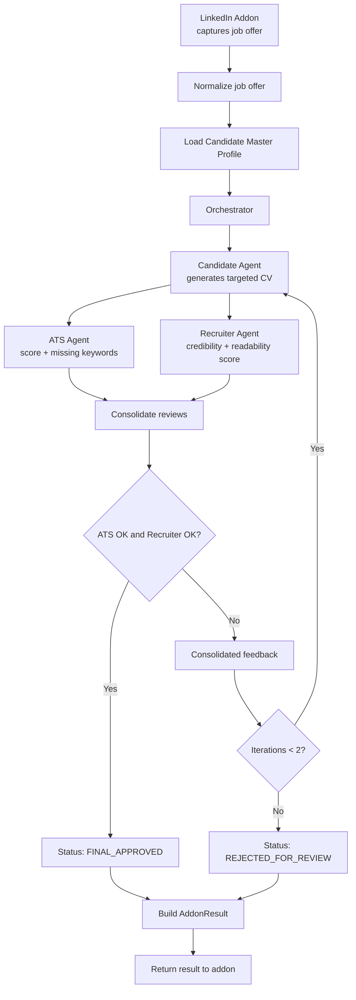

# Backend Design — DreamJob

## Overview

DreamJob helps users tailor their resume to LinkedIn job posts. This document describes the backend architecture for the single-user, open-source demo.

**Goals:** minimal setup friction (`git clone && npm install && npm run dev`), no authentication, local-first.

---

## Stack

| Layer      | Choice                  | Why                                         |
| ---------- | ----------------------- | ------------------------------------------- |
| Runtime    | Node.js + TypeScript    | Widely known, great tooling                 |
| Framework  | Fastify                 | Fast, plugin-based, first-class TS support  |
| Storage    | JSON files (`fs`)       | Zero config — just files, no ORM or DB needed |
| AI         | OpenAI API              | Powers all AI agent operations               |
| PDF Parse  | `pdf-parse`             | PDF text extraction — pure JS, no native deps |
| Upload     | `@fastify/multipart`    | File upload handling for Fastify              |

---

## Data Models

All models use auto-generated string IDs (e.g. `"job_1"`, `"cv_1"`) and `createdAt`/`updatedAt` ISO-8601 timestamps. Each model type is stored in its own JSON file inside the `data/` directory.

### Profile

Single document representing the user's complete professional identity (CandidateMasterProfile). Stored as `data/profile.json`. Retrieved and updated as a whole via `GET` / `PUT /api/profile`.

| Field | Type   | Notes                                    |
| ----- | ------ | ---------------------------------------- |
| id    | String | Always `"default"` (single user)         |
| data  | Object | Full CandidateMasterProfile — see below  |

#### Profile JSON shape

```json
{
  "identity": {
    "name": "Jane Doe",
    "headline": "Product Designer",
    "email": "jane@example.com",
    "phone": "+33...",
    "location": "Paris",
    "links": {
      "linkedin": "https://linkedin.com/in/janedoe",
      "portfolio": "https://janedoe.com",
      "github": "https://github.com/janedoe"
    }
  },
  "targetRoles": ["Senior Product Designer", "Lead Product Designer"],
  "professionalSummaryMaster": "Master summary text",
  "experiences": [
    {
      "experienceId": "exp_01",
      "title": "Product Designer",
      "company": "Company A",
      "location": "Paris",
      "startDate": "2021-01",
      "endDate": "2024-02",
      "description": "Owned core journeys",
      "achievements": [
        { "text": "Improved activation by 18%", "metric": "18%", "proofLevel": "strong" }
      ],
      "skillsUsed": ["Figma", "Design System", "UX Research"]
    }
  ],
  "education": [
    {
      "school": "School X",
      "degree": "Master in Design",
      "field": "Design",
      "year": "2020"
    }
  ],
  "skills": [
    {
      "name": "Figma",
      "category": "tool",
      "level": "advanced",
      "years": 6,
      "evidenceRefs": ["exp_01", "proj_03"]
    }
  ],
  "certifications": [
    {
      "name": "AWS Solutions Architect",
      "issuer": "Amazon",
      "date": "2023-06"
    }
  ],
  "languages": [
    { "name": "French", "level": "native" },
    { "name": "English", "level": "professional" }
  ],
  "projects": [
    {
      "name": "Portfolio Site",
      "description": "Personal portfolio",
      "url": "https://janedoe.com",
      "technologies": ["React", "Next.js"]
    }
  ],
  "references": [
    {
      "name": "John Smith",
      "title": "Engineering Manager",
      "company": "Company A",
      "email": "john@example.com",
      "phone": "+33...",
      "relationship": "Former Manager"
    }
  ],
  "constraints": {
    "preferredCvLanguage": "fr",
    "maxCvPages": 1,
    "mustNotClaim": ["Team management if not proven"]
  }
}
```

### ResumeUpload

Tracks the uploaded PDF resume and its extraction lifecycle. Stored as `data/resume-upload.json`. Single document (one resume at a time for v1).

| Field            | Type     | Notes                                    |
| ---------------- | -------- | ---------------------------------------- |
| id               | String   | Always `"default"` (single user)         |
| originalFilename | String   | e.g. `"jane_resume.pdf"`                 |
| storagePath      | String   | `"data/uploads/resume.pdf"`              |
| uploadedAt       | DateTime | ISO-8601                                 |
| status           | String   | `uploaded` / `extracting` / `extracted` / `confirmed` / `failed` |
| error            | String?  | Error message if status is `failed`      |

### ExtractionResult

Structured output from the AI extraction pipeline. Stored as `data/extraction.json`. Single document.

| Field          | Type     | Notes                                    |
| -------------- | -------- | ---------------------------------------- |
| id             | String   | Always `"default"`                       |
| resumeUploadId | String   | Ref → ResumeUpload id                    |
| extractedAt    | DateTime | ISO-8601                                 |
| rawText        | String   | Plain text extracted from PDF (for debugging) |
| data           | Object   | Same shape as Profile `data` — the extracted draft |
| confidence     | Object   | Mirrors Profile structure with confidence scores per field |
| reviewStatus   | Object   | Per-section/item review tracking         |

#### Confidence map shape

The confidence object mirrors the Profile `data` structure, but each leaf field is replaced with a confidence entry:

```json
{
  "identity": {
    "name": { "score": 0.95, "source": "extracted" },
    "headline": { "score": 0.7, "source": "inferred" },
    "email": { "score": 0.99, "source": "extracted" },
    "phone": { "score": 0.6, "source": "extracted" },
    "location": { "score": 0.8, "source": "extracted" }
  },
  "experiences": [
    {
      "_overall": 0.85,
      "title": { "score": 0.95 },
      "company": { "score": 0.95 },
      "startDate": { "score": 0.7 },
      "endDate": { "score": 0.6 },
      "achievements": [
        { "text": { "score": 0.8 } }
      ]
    }
  ],
  "education": [],
  "skills": []
}
```

- **score**: 0.0–1.0. Fields below 0.7 are "low confidence" and highlighted in the UI.
- **source**: `"extracted"` (found literally in text), `"inferred"` (AI deduced), `"missing"` (not found, AI guessed or left empty).

#### Review status shape

Tracks which sections and items the user has reviewed. A section is "resolved" only when all items in it have `reviewed: true`.

```json
{
  "identity": { "reviewed": false },
  "experiences": [
    { "experienceId": "exp_01", "reviewed": false }
  ],
  "education": [
    { "index": 0, "reviewed": false }
  ],
  "skills": [
    { "name": "Figma", "reviewed": false }
  ],
  "completionStatus": {
    "markedComplete": false,
    "markedCompleteAt": null
  }
}
```

---

### JobOfferRaw

Raw data captured by the browser extension before AI normalization.

| Field            | Type     | Notes                                  |
| ---------------- | -------- | -------------------------------------- |
| id               | String   | e.g. `"raw_1"`                         |
| source           | String   | e.g. "linkedin"                        |
| sourceUrl        | String   | Original job post URL                  |
| capturedAt       | DateTime | When the extension scraped it          |
| htmlSnapshotRef  | String   | Optional — ref to stored HTML snapshot |
| rawText          | String   | Full text extracted from the page      |
| rawFields        | Object   | `{title, company, location, employment_type, ...}` |

### JobPost

Normalized job post created from raw data. Used by the AI agents.

| Field                | Type     | Notes                                  |
| -------------------- | -------- | -------------------------------------- |
| id                   | String   | e.g. `"job_1"`                         |
| jobOfferRawId        | String   | Ref → JobOfferRaw id                   |
| title                | String   | Job title                              |
| company              | String   |                                        |
| description          | String   | Full job description text              |
| url                  | String   | LinkedIn post URL                      |
| salary               | String   | Optional, as posted                    |
| location             | String   |                                        |
| remoteMode           | String   | `onsite` / `hybrid` / `remote`         |
| employmentType       | String   | `full_time` / `part_time` / `contract` / `internship` |
| seniority            | String   | `entry` / `mid` / `senior` / `lead` / `executive` |
| jobSummary           | String   | Short normalized summary               |
| responsibilities     | String[] | Key responsibilities        |
| requirementsMustHave | String[] | Hard requirements           |
| requirementsNiceToHave | String[] | Nice-to-have requirements |
| keywords             | String[] | Extracted keywords          |
| tools                | String[] | Tools mentioned             |
| languages            | String[] | Language requirements       |
| yearsExperienceMin   | Int      | Optional                               |
| postedDate           | DateTime | Optional                               |

### GeneratedCV

Structured, job-targeted CV generated by the Candidate Agent.

| Field                  | Type     | Notes                                              |
| ---------------------- | -------- | -------------------------------------------------- |
| id                     | String   | e.g. `"cv_1"`                                      |
| profileId              | String   | Ref → Profile id                                   |
| jobPostId              | String   | Ref → JobPost id                                   |
| version                | Int      | Iteration count                                    |
| language               | String   | CV language (e.g. "fr", "en")                      |
| title                  | String   | e.g. "CV ciblé - Senior Product Designer"          |
| header                 | Object   | `{fullName, headline, contact, links}`             |
| summary                | String   | Tailored professional summary                      |
| skillsHighlighted      | String[] | Selected skills for this job            |
| experiencesSelected    | Object[] | `[{experienceId, rewrittenBullets[]}]`             |
| educationSelected      | Object[] | Selected education entries                         |
| certificationsSelected | Object[] | Selected certifications                            |
| keywordsCovered        | String[] | Job keywords addressed                  |
| omittedItems           | String[] | Items deliberately excluded             |
| generationNotes        | String[] | Agent reasoning notes                   |

### ATSReview

Output from the ATS Agent — keyword and format compliance check.

| Field             | Type     | Notes                                      |
| ----------------- | -------- | ------------------------------------------ |
| id                | String   | e.g. `"ats_1"`                             |
| cvId              | String   | Ref → GeneratedCV id                       |
| jobPostId         | String   | Ref → JobPost id                           |
| score             | Int      | 0–100                                      |
| passed            | Boolean  |                                            |
| hardFiltersStatus | Object[] | `[{filter, status, evidence}]`             |
| matchedKeywords   | String[] | Keywords found in CV            |
| missingKeywords   | String[] | Keywords absent from CV         |
| formatFlags       | String[] | Formatting issues               |
| recommendations   | String[] | Suggested improvements          |

### RecruiterReview

Output from the Recruiter Agent — human-readability and credibility check.

| Field            | Type     | Notes                              |
| ---------------- | -------- | ---------------------------------- |
| id               | String   | e.g. `"rr_1"`                      |
| cvId             | String   | Ref → GeneratedCV id               |
| jobPostId        | String   | Ref → JobPost id                   |
| score            | Int      | Overall 0–100                      |
| passed           | Boolean  |                                    |
| readabilityScore | Int      | 0–100                              |
| credibilityScore | Int      | 0–100                              |
| coherenceScore   | Int      | 0–100                              |
| evidenceScore    | Int      | 0–100                              |
| strengths        | String[] | What works well         |
| concerns         | String[] | Issues found            |
| recommendations  | String[] | Suggested improvements  |

### ReviewAgreement

Final decision object from the orchestrator.

| Field              | Type     | Notes                                                |
| ------------------ | -------- | ---------------------------------------------------- |
| id                 | String   | e.g. `"ra_1"`                                        |
| jobPostId          | String   | Ref → JobPost id                                     |
| cvId               | String   | Ref → GeneratedCV id                                 |
| cvGenerationOk     | Boolean  |                                                      |
| atsOk              | Boolean  |                                                      |
| recruiterOk        | Boolean  |                                                      |
| reviewAgreementOk  | Boolean  |                                                      |
| finalStatus        | String   | `FINAL_APPROVED` / `REJECTED` / `NEEDS_REVISION`    |
| rejectionReasons   | String[] | Why it was rejected                       |
| iterationCount     | Int      |                                                      |

---

## API Routes

Base path: `/api`

### Profile

| Method | Route            | Description                              |
| ------ | ---------------- | ---------------------------------------- |
| GET    | `/api/profile`   | Get the full profile document            |
| PUT    | `/api/profile`   | Replace the full profile document        |

### Resume Upload & Extraction

| Method | Route                            | Description                                              |
| ------ | -------------------------------- | -------------------------------------------------------- |
| POST   | `/api/resume/upload`             | Upload PDF (multipart), store it, trigger extraction     |
| GET    | `/api/resume/status`             | Get upload + extraction status                           |
| GET    | `/api/resume/extraction`         | Get extraction result with confidence + review status    |
| POST   | `/api/resume/extraction/confirm` | Write extraction data to Profile, mark confirmed         |
| PUT    | `/api/resume/extraction/review`  | Update review status for a section/item                  |
| GET    | `/api/resume/completeness`       | Computed: progress %, strength score, checklist           |

**POST `/api/resume/upload`** — accepts `multipart/form-data` with a single `file` field. Validates PDF only, max 10MB. Stores PDF to `data/uploads/resume.pdf`. Runs extraction synchronously. Returns `{ id, status, extractedData }`.

**GET `/api/resume/status`** — returns the current ResumeUpload document (status, timestamps, error if any).

**GET `/api/resume/extraction`** — returns the full ExtractionResult: extracted data, confidence map, and review status. 404 if no extraction exists.

**POST `/api/resume/extraction/confirm`** — copies `ExtractionResult.data` into `data/profile.json` as the Profile. Updates ResumeUpload status to `"confirmed"`. Returns the new Profile.

**PUT `/api/resume/extraction/review`** request body:

```json
{
  "section": "identity",
  "itemId": "exp_01",
  "reviewed": true
}
```

Updates the corresponding entry in `reviewStatus`. `itemId` is optional (omit for scalar sections like `identity`).

**GET `/api/resume/completeness`** — computed endpoint (no stored model). Returns:

```json
{
  "progress": 60,
  "strengthScore": 72,
  "missingSections": ["certifications"],
  "unresolvedSections": ["experiences", "skills"],
  "checklist": [
    { "label": "Personal info reviewed", "met": true },
    { "label": "All experiences reviewed", "met": false }
  ],
  "canMarkComplete": false
}
```

`canMarkComplete` is `true` only when: identity reviewed, all extracted experiences reviewed, all extracted education reviewed, all extracted skills reviewed.

### Job Posts — Raw

| Method | Route               | Description                                              |
| ------ | ------------------- | -------------------------------------------------------- |
| POST   | `/api/jobs/raw`     | Extension posts raw scraped data; auto-normalizes into a JobPost |
| GET    | `/api/jobs/raw`     | List raw captures                                        |
| GET    | `/api/jobs/raw/:id` | Get one raw capture                                      |

### Job Posts — Normalized

| Method | Route             | Description                  |
| ------ | ----------------- | ---------------------------- |
| GET    | `/api/jobs`       | List normalized job posts    |
| GET    | `/api/jobs/:id`   | Get a normalized job post    |
| PUT    | `/api/jobs/:id`   | Update a job post            |
| DELETE | `/api/jobs/:id`   | Delete a job post            |

### CVs

| Method | Route                                        | Description                        |
| ------ | -------------------------------------------- | ---------------------------------- |
| POST   | `/api/cvs/generate`                          | Generate a tailored CV (kicks off the full agent pipeline) |
| GET    | `/api/cvs`                                   | List all generated CVs             |
| GET    | `/api/cvs/:id`                               | Get a specific generated CV        |
| DELETE | `/api/cvs/:id`                               | Delete a generated CV              |

### Reviews

| Method | Route                                        | Description                        |
| ------ | -------------------------------------------- | ---------------------------------- |
| GET    | `/api/cvs/:id/ats-review`                    | Get ATS review for a CV            |
| GET    | `/api/cvs/:id/recruiter-review`              | Get recruiter review for a CV      |

**POST `/api/cvs/generate` request body:**

```json
{
  "jobPostId": "job_1",
  "language": "fr"
}
```

The endpoint fetches the full profile + job post, runs the multi-agent pipeline (Candidate Agent → ATS Agent → Recruiter Agent → Orchestrator), and stores the GeneratedCV, ATSReview, RecruiterReview, and ReviewAgreement.

---

## Validation

Fastify has built-in request validation via JSON Schema. Each route defines a schema for its request body and params, and Fastify rejects invalid requests with a `400` before the handler runs.

### Approach

- Define schemas with `@sinclair/typebox` (ships with Fastify) for type-safe schema + TypeScript type from a single definition.
- Schemas live alongside their routes (co-located in each route file).
- Only validate at the API boundary — no redundant checks inside services.

### What to validate

| Area         | Rules                                                                 |
| ------------ | --------------------------------------------------------------------- |
| Required fields | Reject missing required fields (e.g. `identity.name`, `identity.email`) |
| Types        | Strings are strings, numbers are numbers, dates are ISO-8601 strings  |
| Enums        | `employmentType`, `seniority`, `remoteMode`, `level`, `finalStatus` must be one of the allowed values |
| String limits | Reasonable max lengths (e.g. `name` ≤ 200, `description` ≤ 10000)   |
| ID params    | Route `:id` params must be non-empty strings                          |

### Error format

Fastify's default validation error response:

```json
{
  "statusCode": 400,
  "error": "Bad Request",
  "message": "body/email must match format \"email\""
}
```

No custom error handler needed — the default format is clear enough for a demo.

---

## AI Layer

```
services/ai/
  openai.ts   — OpenAI implementation (OpenAI SDK)
```

All AI agent operations (normalization, CV generation, ATS review, recruiter review) use the OpenAI API via the official SDK. Requires `OPENAI_API_KEY` env var.

---

## Resume Extraction Pipeline

```
services/
  extraction.ts   — PDF parsing + AI extraction + post-processing
  completeness.ts — Completeness scoring (pure computation)
```

### Extraction (`extraction.ts`)

Three-stage pipeline triggered by `POST /api/resume/upload`:

1. **PDF text extraction** — uses `pdf-parse` to extract plain text from the uploaded PDF. The raw text is stored in `ExtractionResult.rawText` for debugging.

2. **AI structured extraction** — sends the raw text to OpenAI via `services/ai/openai.ts` using a single structured output call. The prompt instructs the model to:
   - Extract data into the exact Profile JSON shape
   - Return a parallel confidence object with 0.0–1.0 scores per field
   - Follow rules: one experience per job, bullets as separate achievements, dates in ISO partial format, skills categorized

3. **Post-processing** — assigns `experienceId` values (`exp_01`, `exp_02`, …), initializes all `reviewStatus` entries to `reviewed: false`, normalizes date formats, writes `data/extraction.json`, and updates `data/resume-upload.json` status to `"extracted"`.

New function in `services/ai/openai.ts`:

```
extractProfileFromText(text: string): Promise<{ data: ProfileDraft, confidence: ConfidenceMap }>
```

### Completeness (`completeness.ts`)

Pure function — computed on every `GET /api/resume/completeness` request, no stored model.

**Progress:** `reviewed items / total items × 100`

**Strength score (0–100):**
- Identity with name + email + headline: 15 pts
- 1+ experiences: 15 pts, 2+ experiences: 25 pts
- Experiences with 2+ achievements: 5 pts each (up to 15)
- 1+ education: 10 pts
- 5+ skills: 10 pts, 10+ skills: 15 pts
- Certifications: 5 pts
- Projects: 5 pts
- Languages: 5 pts
- Professional summary: 5 pts

**canMarkComplete** requires all of:
- Identity section reviewed
- All extracted experiences reviewed
- All extracted education reviewed
- All extracted skills reviewed

---

## Agent Contracts

Each agent has a strict input/output contract. The orchestrator (`cv-generator.ts`) calls them in sequence and passes data between them.

### Candidate Agent

**Role:** Create the most relevant targeted CV from the job offer and the candidate master profile.

**Input:**

```json
{
  "job_offer": "JobPost",
  "candidate_master_profile": "Profile",
  "generation_rules": {
    "language": "fr",
    "max_pages": 1,
    "tone": "professional",
    "truthfulness_mode": "strict"
  },
  "revision_context": {
    "previous_ats_review": null,
    "previous_recruiter_review": null
  }
}
```

`revision_context` is populated on retry iterations with the previous ATS and/or Recruiter review so the agent can address feedback.

**Output:**

```json
{
  "generated_cv": "GeneratedCV",
  "coverage_map": {
    "matched_requirements": [
      { "requirement": "Design systems", "evidence_ref": "exp_01" }
    ],
    "uncovered_requirements": ["Stakeholder management"]
  },
  "self_check": {
    "unsupported_claims_found": false,
    "warnings": []
  }
}
```

**Business rules:**

- Never invent an experience or skill not present in the master profile.
- Prioritize items backed by evidence in the master profile.
- Optimize for the target job without breaking overall career coherence.

### ATS Agent

**Role:** Measure machine/ATS compatibility between the generated CV and the job offer.

**Input:**

```json
{
  "job_offer": "JobPost",
  "generated_cv": "GeneratedCV",
  "scoring_rules": {
    "passing_score": 75,
    "weight_keywords": 0.5,
    "weight_hard_filters": 0.3,
    "weight_structure": 0.2
  }
}
```

**Output:**

```json
{
  "ats_review": "ATSReview",
  "decision": {
    "status": "pass",
    "blocking_issues": []
  }
}
```

**Scoring formula:** `ATS Score = 50% keywords + 30% hard filters + 20% structure`

**Scoring thresholds:**

| Range  | Meaning                 |
| ------ | ----------------------- |
| 0–49   | Low matching            |
| 50–74  | Partially compatible    |
| 75–100 | Acceptable (pass)       |

**Criteria:** keyword presence, hard filter coverage, clear job titles, no vague wording on key skills.

### Recruiter Agent

**Role:** Evaluate whether the CV appears credible, readable, and convincing to a human recruiter.

**Input:**

```json
{
  "job_offer": "JobPost",
  "generated_cv": "GeneratedCV",
  "review_rules": {
    "passing_score": 75,
    "weight_readability": 0.25,
    "weight_credibility": 0.35,
    "weight_evidence": 0.2,
    "weight_coherence": 0.2
  }
}
```

**Output:**

```json
{
  "recruiter_review": "RecruiterReview",
  "decision": {
    "status": "pass",
    "blocking_issues": []
  }
}
```

**Scoring formula:** `Recruiter Score = 35% credibility + 25% readability + 20% coherence + 20% evidence`

**Scoring thresholds:**

| Range  | Meaning                 |
| ------ | ----------------------- |
| 0–49   | Low credibility         |
| 50–74  | Credible but weak       |
| 75–100 | Acceptable (pass)       |

**Criteria:** readability, career-to-role coherence, concrete proof of claims, no over-promising, density vs. clarity balance.

---

## Orchestration & Workflow

### Decision Logic

The CV is approved (`FINAL_APPROVED`) when **all** of these hold:

1. The Candidate Agent produced a usable CV (`cv_generation_ok = true`)
2. ATS score ≥ passing threshold and no blocking issues (`ats_ok = true`)
3. Recruiter score ≥ passing threshold and no blocking issues (`recruiter_ok = true`)

The final agreement requires both evaluator agents (ATS **and** Recruiter) to pass.

### Revision Policy

- If **ATS fails** → feed ATS review back to Candidate Agent for revision.
- If **Recruiter fails** → feed Recruiter review back to Candidate Agent for revision.
- If **both fail** → single feedback pass to Candidate Agent with consolidated ATS + Recruiter feedback.
- **Maximum 2 revision iterations.** After 2 failures the workflow ends with `REJECTED_FOR_REVIEW`.

### Workflow States

```
JOB_IMPORTED → JOB_NORMALIZED → CV_GENERATED → ATS_REVIEWED → RECRUITER_REVIEWED
  → REVISION_REQUESTED (loop back to CV_GENERATED, max 2×)
  → FINAL_APPROVED | REJECTED_FOR_REVIEW
  → RESULT_SENT_TO_ADDON
```

### AddonResult Construction

Regardless of outcome, the orchestrator returns an `AddonResult` to the caller with:

- `status`: `"accepted"` or `"rejected"` (mapped from `FINAL_APPROVED` / `REJECTED_FOR_REVIEW`)
- `overall_score`: combined score
- `scores`: `{ ats_score, recruiter_score }`
- `strengths`, `weaknesses`, `recommendations`: aggregated from both reviews

---

## Pipeline Flow



---

## Resume Extraction — Design Decisions

| Decision | Rationale |
| -------- | --------- |
| Extraction output matches Profile shape exactly | No mapping layer needed — direct copy on confirm, existing routes work unchanged |
| Confidence is a parallel structure, not embedded in Profile | Profile stays clean for downstream consumers (CV generation) |
| Review status lives in ExtractionResult, not Profile | Review is extraction metadata, not profile data |
| Completeness is computed, not stored | Avoids staleness — always reflects current state |
| Synchronous extraction | Simpler for POC; async can be added later if needed |
| Single resume only (overwrite on re-upload) | Matches v1 scope — no multi-resume merge |

---

## Project Structure

```
src/
  server.ts              — Fastify app setup, plugin registration
  routes/
    profile.ts           — Profile CRUD
    resume.ts            — Resume upload, extraction, review, completeness
    jobs.ts              — Job post + raw capture endpoints
    cvs.ts               — CV generation + review endpoints
  services/
    ai/
      openai.ts          — OpenAI API calls (incl. extractProfileFromText)
    store.ts             — Thin read/write layer over JSON files (fs)
    extraction.ts        — PDF parsing + AI extraction pipeline
    completeness.ts      — Completeness scoring (pure computation)
    cv-generator.ts      — Orchestrates the multi-agent pipeline
    normalize.ts         — Normalizes raw job data into JobPost
  seed.ts                — Writes demo profile data to data/profile.json
data/                    — Auto-created on first run, gitignored
  uploads/               — Stored PDF files
    resume.pdf           — The uploaded resume
  profile.json           — Single profile document
  resume-upload.json     — ResumeUpload document
  extraction.json        — ExtractionResult document
  jobs-raw.json          — Raw job captures
  jobs.json              — Normalized job posts
  cvs.json               — Generated CVs
  ats-reviews.json       — ATS review results
  recruiter-reviews.json — Recruiter review results
  review-agreements.json — Final review decisions
.env.example             — Template with required env vars
package.json
tsconfig.json
```

---

## Setup & Configuration

### Environment Variables

```env
# Required
OPENAI_API_KEY=sk-...

# Optional
PORT=3000                   # Server port (default: 3000)
```

### Getting Started

```bash
git clone <repo-url>
cd dreamjob
cp .env.example .env       # Add your API key(s)
npm install
npm run seed                # Load demo profile data into data/
npm run dev                 # Start Fastify on :3000
```

### Scripts

| Script          | Command                | Purpose                    |
| --------------- | ---------------------- | -------------------------- |
| `dev`           | `tsx watch src/server.ts` | Dev server with hot reload |
| `build`         | `tsc`                  | Compile TypeScript         |
| `start`         | `node dist/server.js`  | Production start           |
| `seed`          | `tsx src/seed.ts`      | Write demo profile to data/|

---

## Seed Data

The seed script writes a `data/profile.json` file containing:
- Identity (name, headline, contact, links)
- Target roles and constraints
- 2-3 work experiences with achievements (text, metric, proof level) and skills used
- 1-2 education entries
- 8-10 skills across categories with years and evidence refs
- 1-2 certifications
- 2-3 languages with proficiency levels
- 2-3 portfolio projects
- 1-2 references

This lets users immediately try the tailoring feature without manual data entry.
