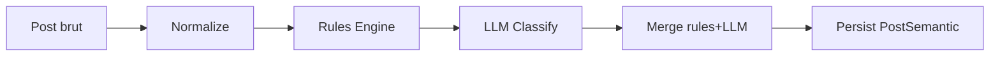

# Scrollout — Instagram Content Intelligence

> Anciennement "ECHA". Renommé Scrollout (commit a3c1885, 2026-03-28).

## Quick Reference

```bash
# Devices
npm run devices          # Scan connected devices + save .env.devices
npm run devices:wifi     # Enable ADB WiFi
npm run devices:list     # Show saved devices

# Capture (nécessite device + Instagram ouvert)
npx tsx src/index.ts [scrolls]       # Dump accessibility tree (ponctuel)
npx tsx src/capture.ts [seconds]     # Écoute logcat AccessibilityService (temps réel)
npx tsx src/auto-capture.ts [n] [ms] # Auto-scroll + screenshot + dump UI

# Analyse
npx tsx src/analyzer.ts [session.json]  # Analyse complète + auto-ingest SQLite

# Database
npm run db:migrate       # Appliquer migrations Prisma
npm run db:generate      # Régénérer le client Prisma
npm run db:ingest        # Ingérer toutes les sessions analysées dans SQLite

# Enrichissement
npm run enrich                           # Enrichir (Ollama, batch 20)
npx tsx src/enrich.ts --openai           # Enrichir via OpenAI
npm run enrich:rules                     # Rules seulement (pas de LLM)
npm run enrich:dry                       # Dry run (preview sans écriture)
npx tsx src/enrich.ts --with-audio       # + transcription audio vidéos (Whisper local)
npx tsx src/enrich.ts --whisper-api      # + transcription via Whisper API (OpenAI)

# Tests
npm test                 # Vitest run (tous les tests)
npm run test:watch       # Vitest watch mode

# Visualizer (debug)
npm run visualizer       # Dashboard debug sur http://localhost:3000

# APK
npm run apk:install -- <path.apk>    # Install APK sur tous les devices
```

## Vision

Scrollout capture et analyse l'activité Instagram d'un utilisateur pour produire un **rapport structuré** de sa consommation : quels contenus vus, combien de temps sur chacun, quelle catégorie, quelle origine (organique/algo/pub).

**Objectif final** : workflow complet **capture → enrichissement sémantique → scoring politique/polarisation → profil utilisateur** avec pipeline documentaire complet.

## Roadmap

Voir [`docs/ROADMAP.md`](docs/ROADMAP.md) pour le plan détaillé du MVP en 2 niveaux :
- **Niveau post** : enrichissement sémantique, scoring politique (0-4), polarisation (0-1), narratif, confiance
- **Niveau utilisateur** : agrégation 7j/30j/90j, profils de consommation, indices de diversité

### État d'avancement
- **Phase 0 (cadrage)** : ✅ — périmètre, taxonomie, schéma Prisma
- **Phase 1 (audit data)** : ✅ — capture fonctionnelle, sessions collectées
- **Phase 2 (design modèle post)** : ✅ — `PostSemantic` complet (taxonomie 5 niveaux, axes politiques, polarisation, narratif, vidéo)
- **Phase 3 (implémentation post)** : 🔶 partiel — pipeline enrichissement fonctionnel (rules + LLM), manque calibration
- **Phase 4-8** : ❌ à faire (profil utilisateur, dashboard final)

## Stack

| Composant | Technologie | Rôle |
|-----------|-------------|------|
| Scripts capture/analyse | TypeScript + tsx | Orchestration ADB, parsing, reporting |
| Service Android natif | Java (AccessibilityService) | Extraction arbre accessibilité Instagram |
| App Capacitor | Capacitor 8 + Android | WebView + écrans dashboard natifs |
| WebView tracker | JavaScript vanilla | DOM parsing + IntersectionObserver + dwell time |
| Database | SQLite + Prisma (better-sqlite3) | Stockage sessions, posts, enrichissement |
| Enrichissement | Ollama (llama3.1:8b) / OpenAI | Classification sémantique + scoring |
| Transcription | Whisper (local + API) | STT pour vidéos/reels |
| Visualizer | Express + WebSocket | Dashboard debug temps réel |

## Architecture

```
scrollout/
├── src/                              # Scripts TypeScript (PC-side)
│   ├── index.ts                      # Dump ponctuel accessibilité
│   ├── capture.ts                    # Écoute temps réel logcat ECHA_DATA
│   ├── auto-capture.ts               # Auto-scroll + screenshot + dump
│   ├── analyzer.ts                   # Analyse session: extraction, catégorisation, attention
│   ├── enrich.ts                     # CLI enrichissement (entry point)
│   ├── parser.ts                     # Parsing XML UIAutomator
│   ├── deep-extract.ts               # Extraction enrichie (image descriptions)
│   ├── adb.ts / adb-path.ts          # Wrapper ADB commands
│   ├── logcat-listener.ts            # Écoute logcat AccessibilityService
│   ├── logcat-tap.ts                 # EventEmitter logcat (ECHA_DATA + ECHA_MLKIT)
│   ├── listen.ts                     # Entry point listener
│   ├── ingest-all.ts                 # Ingestion batch sessions → SQLite
│   ├── db/
│   │   ├── client.ts                 # Prisma client (better-sqlite3 adapter)
│   │   └── ingest.ts                 # Pipeline _analysis.json → SQLite
│   ├── enrichment/                   # Pipeline d'enrichissement sémantique
│   │   ├── pipeline.ts               # Orchestration: normalize → rules → LLM → merge → persist
│   │   ├── normalize.ts              # Nettoyage texte, fusion sources, détection langue
│   │   ├── rules-engine.ts           # Classification par dictionnaires (sans LLM)
│   │   ├── dictionaries/
│   │   │   ├── index.ts              # Exports centralisés
│   │   │   ├── taxonomy.ts           # Taxonomie 5 niveaux (domaines → sujets précis)
│   │   │   ├── topics-keywords.ts    # Mots-clés par thème
│   │   │   ├── political-actors.ts   # Personnalités politiques FR
│   │   │   ├── political-accounts.ts # Comptes Instagram politiques connus
│   │   │   ├── political-axes.ts     # Axes political compass
│   │   │   ├── militant-hashtags.ts  # Hashtags militants
│   │   │   ├── conflict-vocabulary.ts # Vocabulaire polarisant
│   │   │   └── media-category.ts     # Catégories média
│   │   ├── llm/
│   │   │   ├── index.ts              # Factory LLM provider
│   │   │   ├── provider.ts           # Interface LLMProvider
│   │   │   ├── ollama.ts             # Ollama (local, gratuit)
│   │   │   ├── openai.ts             # OpenAI API
│   │   │   └── prompts.ts            # System + user prompts enrichissement
│   │   └── __tests__/                # 5 suites de tests (32+ tests)
│   ├── media/
│   │   ├── download.ts               # Téléchargement vidéo depuis URL CDN
│   │   ├── audio-extract.ts          # Extraction audio via ffmpeg
│   │   ├── transcribe.ts             # Abstraction Whisper (local + API)
│   │   └── pipeline.ts               # Orchestration download → extract → transcribe
│   ├── mobile-sync/
│   │   └── client.ts                 # Sync données device ↔ PC
│   └── visualizer/
│       ├── server.ts                 # HTTP + WebSocket + live ingest
│       ├── api.ts                    # REST API (sessions, posts, stats, enrichissement)
│       └── public/
│           ├── index.html            # Dashboard debug (6 panneaux)
│           └── dashboard.js          # Client WS + rendu DOM
├── echa-android/                     # APK AccessibilityService (Java)
│   └── app/src/main/java/com/lab/echa/
│       ├── InstagramAccessibilityService.java  # Service principal
│       ├── NodeExtractor.java                  # Extraction arbre nodes
│       ├── PostTracker.java                    # Tracking posts + dwell time
│       ├── EchaDatabase.java                   # SQLite embarqué device
│       └── EchaHttpServer.java                 # HTTP server pour sync
├── echa-app/                         # App Capacitor (écrans natifs)
│   ├── src/
│   │   ├── main.ts / app-shell.ts    # Entry + routing
│   │   ├── screens/                  # screen-home, screen-posts, screen-enrichment, screen-settings
│   │   ├── services/                 # api, db-bridge, native-bridge
│   │   └── styles/theme.ts           # Design tokens
│   ├── www/
│   │   ├── index.html                # Dashboard ECHA
│   │   ├── tracker.js                # Script injecté dans WebView Instagram
│   │   └── enrichment.js             # Visualisation enrichissement
│   └── android/                      # Projet Android généré par Capacitor
├── prisma/
│   └── schema.prisma                 # Session, Post, PostSemantic, SessionMetrics
├── scripts/
│   └── scan-devices.ts               # Détection devices ADB + WiFi
├── docs/
│   ├── ROADMAP.md                    # Plan MVP complet
│   ├── ROADMAP.epic.md               # Suivi epic/task
│   └── REPLAN.md                     # Notes de replanification
├── data/                             # Sessions capturées, screenshots, rapports (gitignored)
└── package.json
```

## Pipeline d'enrichissement

Le coeur actif du projet. Pipeline en 5 étapes :



1. **Normalize** : fusion caption + hashtags + image description + OCR/transcription, nettoyage bruit UI Instagram, détection langue
2. **Rules Engine** : classification par dictionnaires (political-actors, militant-hashtags, conflict-vocabulary, topics-keywords) — rapide, gratuit, déterministe
3. **LLM Classify** : enrichissement fin via Ollama ou OpenAI — taxonomie 5 niveaux, scoring politique, polarisation, narratif, axes political compass
4. **Merge** : fusion rules + LLM, flag `reviewFlag` si divergence significative
5. **Persist** : écriture PostSemantic dans SQLite via Prisma

### Taxonomie 5 niveaux
| Niveau | Exemple | Cardinalité |
|--------|---------|-------------|
| 1. Domaine | actualité, divertissement | ~6 |
| 2. Thème | immigration, gaming | ~24 |
| 3. Sujet | politique migratoire | ~150 |
| 4. Sujet précis | "Faut-il limiter l'immigration ?" | variable |
| 5. Marqueur/Entité | Marine Le Pen, #FreePalestine | détecté dynamiquement |

### Modèle PostSemantic (Prisma)
Champs principaux : `domains`, `mainTopics`, `subjects`, `preciseSubjects`, `politicalActors`, `tone`, `primaryEmotion`, `politicalExplicitnessScore` (0-4), `polarizationScore` (0-1), axes political compass (economic/societal/authority/system), `narrativeFrame`, `mediaCategory`, `confidenceScore`, `reviewFlag`, `audioTranscription`.

## Dépendances externes

| Outil | Usage | Installation |
|-------|-------|-------------|
| ADB (platform-tools) | Communication device Android | `~/lab/platform-tools/adb.exe` |
| Ollama | LLM local (llama3.1:8b) | `ollama serve` + `ollama pull llama3.1:8b` |
| OpenAI API | LLM cloud (fallback) | `OPENAI_API_KEY` dans .env |
| ffmpeg | Extraction audio vidéos | PATH system |
| Whisper | Transcription audio | Local ou API OpenAI |

## 3 Modes de capture

### 1. AccessibilityService (APK natif)
- **Source** : arbre accessibilité Android de l'app Instagram native
- **Communication** : logcat tag `ECHA_DATA`, chunks si > 3900 chars

### 2. ADB + UIAutomator (scripts PC)
- **Source** : `uiautomator dump` + `screencap` via ADB

### 3. WebView Capacitor (en cours)
- **Source** : DOM Instagram mobile web via WebView

## Niveaux d'attention
| Niveau | Durée | Signification |
|--------|-------|---------------|
| `skipped` | < 0.5s | Scrollé sans regarder |
| `glanced` | 0.5 - 2s | Vu rapidement |
| `viewed` | 2 - 5s | Consulté normalement |
| `engaged` | > 5s | Engagement fort |

## Conventions

- **Langage** : TypeScript strict pour scripts, Java pour Android natif
- **Runtime** : `tsx` (pas ts-node)
- **Tests** : Vitest — chaque fix/feature doit avoir un test
- **Pas de framework frontend** dans l'app Capacitor (vanilla JS/HTML)
- **Data** : tout dans `data/` (gitignored), format JSON
- **Logs** : `[ISO timestamp] message` pour tous les scripts
- **ADB** : toujours utiliser `findAdbPath()` ou wrapper `adb.ts`
- **Nommage fichiers** : kebab-case pour TS, PascalCase pour Java
- **DB** : SQLite via Prisma avec better-sqlite3 adapter
- **LLM** : abstraction `LLMProvider` — jamais de dépendance directe à un fournisseur
