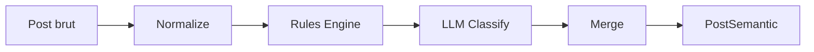

# Scrollout

**Tu scrolles. L'algorithme choisit. Tu ne vois rien.**

Scrollout capture ce qu'Instagram te montre vraiment et te rend visible ce qui est invisible : les thèmes, la polarisation, les narratifs, ta bulle de filtre.

Open source. Gratuit. 100% local.

---

## Manifeste

> L'algorithme te connait. Toi, tu ne le connais pas.

### 1. Le feed n'est pas neutre

Chaque post a ete choisi pour toi. Pas par tes amis -- par un algorithme qui optimise ton temps d'ecran.

### 2. La bulle est invisible

Les memes recits, les memes angles, repetes jusqu'a devenir ta normalite. La polarisation n'a pas besoin que tu sois d'accord. Elle a juste besoin que tu regardes.

### 3. Exposition =/= conviction

On mesure ce qu'on te montre, pas ce que tu penses. L'un est un fait. L'autre serait de la speculation.

### 4. Reprends le controle

Avec ces donnees, tu peux decider en connaissance de cause.

**"On ne peut pas combattre ce qu'on ne peut pas voir."**

---

## Projet citoyen

Scrollout est ne d'un constat simple : personne ne sait ce que l'algorithme lui montre vraiment.

Pas de levee de fonds, pas de business model, pas de donnees collectees.
Juste du code open source et la conviction que la transparence algorithmique est un droit, pas un luxe.

- **100% local** -- Tes donnees ne quittent jamais ton telephone.
- **Open source** -- Tout le code est public. Tu peux verifier, modifier, contribuer.
- **Sans pub, sans compte** -- Pas d'inscription, pas de tracking, pas de monetisation.

---

## Comment ca marche

```
Tu scrolles → On decrypte → Tu comprends → Ton Wrapped
```

### 01. Tu scrolles

Scrollout tourne en arriere-plan pendant que tu utilises Instagram normalement. Rien ne change dans ton experience. L'app observe silencieusement ce que l'algorithme te propose.

### 02. On decrypte

Chaque contenu est analyse automatiquement : de quoi ca parle, quel recit ca porte, si c'est politique, a quel point c'est polarisant. Tout ca reste sur ton telephone.

### 03. Tu comprends

Tu accedes a ton profil d'exposition. Pas un jugement, un miroir. Tu vois enfin ce que l'algorithme a decide de te montrer -- et ce qu'il a choisi de te cacher.

### 04. Ton Wrapped

Comme un Spotify Wrapped de ton feed Instagram. 19 slides animees qui resument ta consommation : ton profil, ta bulle, tes biais, tes records de scroll.

---

## Pipeline d'enrichissement

Le coeur du projet. Chaque post passe par 5 etapes :



| Etape | Role | Technologie |
|-------|------|-------------|
| **Normalize** | Fusion caption + hashtags + OCR + transcription, nettoyage bruit UI, detection langue | TypeScript |
| **Rules Engine** | Classification par dictionnaires (acteurs politiques, hashtags militants, vocabulaire polarisant) | Deterministe, gratuit |
| **LLM Classify** | Taxonomie 5 niveaux, scoring politique, polarisation, narratif, axes political compass | Ollama (local) ou OpenAI |
| **Merge** | Fusion rules + LLM, flag `reviewFlag` si divergence significative | TypeScript |
| **Persist** | Ecriture PostSemantic dans SQLite via Prisma | better-sqlite3 |

### Taxonomie 5 niveaux

| Niveau | Exemple | Cardinalite |
|--------|---------|-------------|
| 1. Domaine | actualite, divertissement | ~6 |
| 2. Theme | immigration, gaming | ~24 |
| 3. Sujet | politique migratoire | ~150 |
| 4. Sujet precis | "Faut-il limiter l'immigration ?" | variable |
| 5. Marqueur/Entite | Marine Le Pen, #FreePalestine | detecte dynamiquement |

### Scoring

- **Politique** : 0 (neutre) → 4 (militant)
- **Polarisation** : 0 (factuel) → 1 (polarisant)
- **Narratif** : apocalyptique, heroique, oppression, nous-vs-eux, victimaire, complotisme, etc.
- **Emotions** : colere, peur, joie, espoir, degout, surprise, mepris, etc.
- **Axes** : economic, societal, authority, system (political compass)

### Niveaux d'attention

| Niveau | Duree | Signification |
|--------|-------|---------------|
| `skipped` | < 0.5s | Scrolle sans regarder |
| `glanced` | 0.5--2s | Vu rapidement |
| `viewed` | 2--5s | Consulte |
| `engaged` | > 5s | Engagement fort |

---

## Architecture

```
scrollout/
├── src/                        # Scripts TypeScript (PC-side)
│   ├── capture.ts              # Capture temps reel logcat
│   ├── analyzer.ts             # Analyse session + ingest SQLite
│   ├── enrich.ts               # CLI enrichissement (entry point)
│   ├── enrichment/             # Pipeline semantique
│   │   ├── pipeline.ts         # Orchestration normalize → rules → LLM → persist
│   │   ├── normalize.ts        # Nettoyage texte, fusion sources, detection langue
│   │   ├── rules-engine.ts     # Classification par dictionnaires
│   │   ├── dictionaries/       # Taxonomie, acteurs politiques, hashtags militants
│   │   └── llm/                # Providers Ollama / OpenAI + prompts
│   ├── media/                  # Download video, extraction audio, transcription Whisper
│   ├── db/                     # Prisma client + ingest SQLite
│   └── visualizer/             # Dashboard debug (Express + WebSocket)
├── echa-app/                   # App Capacitor (Android)
│   ├── src/
│   │   ├── screens/            # screen-home, screen-wrapped, screen-transparence
│   │   ├── services/           # db-bridge, graph-ingest, enrichment-daemon
│   │   └── tracker/            # scrollout-ui (IntersectionObserver + dwell time)
│   ├── www/                    # Build Vite (HTML + assets SVG wrapped)
│   └── android/                # Projet Android genere par Capacitor
├── echa-android/               # APK AccessibilityService natif (Java)
│   └── app/src/main/java/
│       ├── InstagramAccessibilityService.java
│       ├── NodeExtractor.java
│       ├── PostTracker.java
│       ├── EchaDatabase.java
│       └── EchaHttpServer.java
├── prisma/
│   └── schema.prisma           # Session, Post, PostSemantic, SessionMetrics
├── scrollout-site/             # Landing page (Astro)
├── scripts/                    # Utilitaires (scan-devices, etc.)
└── docs/                       # Roadmap, replanification
```

## Stack technique

| Composant | Technologie | Role |
|-----------|-------------|------|
| Scripts capture/analyse | TypeScript + tsx | Orchestration ADB, parsing, reporting |
| Service Android natif | Java (AccessibilityService) | Extraction arbre accessibilite Instagram |
| App Capacitor | Capacitor 8 + Lit | WebView + ecrans dashboard + Wrapped |
| WebView tracker | JavaScript vanilla | DOM parsing + IntersectionObserver + dwell time |
| Database | SQLite + Prisma (better-sqlite3) | Sessions, posts, enrichissement |
| Enrichissement | Ollama (llama3.1:8b) / OpenAI | Classification semantique + scoring |
| Transcription | Whisper (local + API) | STT pour videos/reels |
| Landing page | Astro | Site public scrollout |
| Tests | Vitest | Unitaires + integration |

## 3 modes de capture

### 1. AccessibilityService (APK natif)
L'app `echa-android` tourne en service Android et lit l'arbre d'accessibilite d'Instagram en temps reel. Communication via logcat (`ECHA_DATA`).

### 2. ADB + UIAutomator (scripts PC)
Les scripts `src/capture.ts` et `src/auto-capture.ts` utilisent `uiautomator dump` + `screencap` via ADB depuis le PC.

### 3. WebView Capacitor
L'app `echa-app` injecte un tracker JavaScript dans une WebView Instagram mobile web pour capturer les posts via le DOM.

---

## Installation

### Prerequis

- Node.js LTS
- ADB (Android Debug Bridge)
- Appareil Android avec debogage USB active
- Ollama (optionnel, pour enrichissement local)
- ffmpeg (optionnel, pour transcription audio)

### Setup

```bash
git clone https://github.com/ChariereFiedler/scrollout.git
cd scrollout
npm install
npm run db:generate
```

### Commandes

```bash
# Appareils
npm run devices                          # Scan appareils ADB
npm run devices:wifi                     # Activer ADB WiFi

# Capture
npx tsx src/capture.ts [seconds]         # Capture temps reel
npx tsx src/auto-capture.ts [n] [ms]     # Auto-scroll + capture

# Enrichissement
npm run enrich                           # Ollama (local, gratuit)
npx tsx src/enrich.ts --openai           # OpenAI (cloud)
npm run enrich:rules                     # Rules only (pas de LLM)
npx tsx src/enrich.ts --with-audio       # + transcription Whisper

# App Android
cd echa-app
npx vite build && npx cap sync android
cd android && ./gradlew assembleDebug

# Tests
npm test                                 # Vitest (tous les tests)
npm run test:watch                       # Watch mode

# Visualizer (debug)
npm run visualizer                       # Dashboard sur http://localhost:3000
```

---

## Wrapped

19 slides animees style Spotify Wrapped :

| Slide | Contenu |
|-------|---------|
| Domaines | Repartition thematique du feed |
| Bulle de filtre | % de contenus dans le meme sens |
| Renforcement | X contenus sur 10 confirment tes opinions |
| Emotions | Intensite emotionnelle du feed |
| Sujets absents | Ce qui n'apparait pas dans ton feed |
| Vue vs accroche | Ce que tu vois vs ce qui te retient |
| Skip rate | % de contenus zappes |
| Sponsorise | Temps passe sur les pubs |
| Narratifs | Cadres narratifs dominants |
| Emotions map | Cartographie emotionnelle (bubbles) |
| Compass | Position sur le political compass |
| Comptes | Podium des comptes influents |
| Formats | Reels vs photos vs carrousels |
| Signaux | Tactiques de persuasion detectees |
| Attention politique | Funnel d'attention par niveau |
| Profil | Ton archetype (Le militant, L'informe, Le zappeur...) |
| Records | Distance scrollee, temps, sessions |
| Recap | Synthese en 7 metriques |
| Next | Pistes pour elargir ton feed |

---

## Roadmap

Voir [`docs/ROADMAP.md`](docs/ROADMAP.md) pour le plan detaille.

- **Phase 0--3** (done) : Capture, schema, pipeline enrichissement post
- **Phase 4--5** (next) : Profil utilisateur, agregation 7j/30j/90j
- **Phase 6--8** (later) : Dashboard final, indices de diversite, export

---

## Contribuer

Le projet est open source. Les contributions sont les bienvenues.

1. Fork le repo
2. Cree une branche (`git checkout -b feat/ma-feature`)
3. Commit (`git commit -m 'feat: ma feature'`)
4. Push (`git push origin feat/ma-feature`)
5. Ouvre une Pull Request

---

## Licence

MIT
