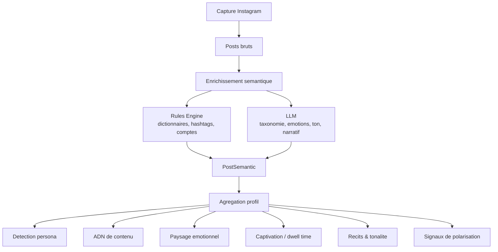
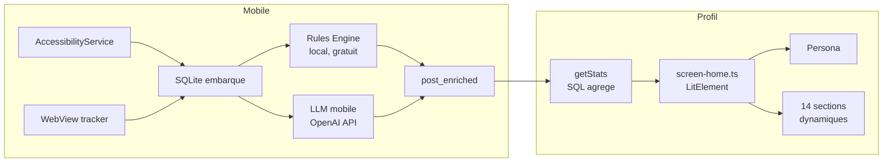

# Scrollout — Profil Utilisateur : "On te connait"

> Comment Scrollout transforme des donnees brutes de scroll en un miroir de ta consommation Instagram.

---

## Le concept

Chaque seconde passee sur Instagram genere des signaux : ce que tu regardes, ce que tu ignores, combien de temps tu t'arretes, sur quoi tu reagis. L'algorithme d'Instagram utilise ces signaux pour te montrer plus de ce qui te retient.

**Scrollout intercepte ces memes signaux et te les rend.**

Le profil n'est pas un simple dashboard de statistiques. C'est une **lecture comportementale** qui montre a l'utilisateur que l'app comprend ses habitudes mieux qu'il ne les comprend lui-meme.

---

## Architecture du profil



---

## Les sections du profil

### 1. Persona — "Qui es-tu pour l'algorithme ?"

A partir des donnees agregees, Scrollout attribue automatiquement un **profil comportemental** parmi 8 personas :

| Persona | Condition de detection | Message |
|---------|----------------------|---------|
| **L'Engage** | >35% politique + polarisation >0.3 | "Tu vis ton feed comme un terrain de conviction" |
| **Le Vigilant** | >20% politique | "Tu gardes un oeil sur l'actualite politique" |
| **Le Zappeur** | >60% posts ignores | "Tu scrolles vite, tu cherches le contenu qui merite ton arret" |
| **L'Immersif** | >35% posts engages (>5s) | "Tu prends le temps. L'algorithme te connait bien" |
| **Le Spectateur** | Emotion dominante = humour/amusement | "Ton feed est un theatre" |
| **L'Inspire** | Domaine dominant = lifestyle | "Ton feed est un mood board algorithmique" |
| **L'Informe** | Domaine dominant = information/actu | "L'algorithme te maintient dans un flux continu d'actualite" |
| **L'Explorateur** | Aucun pattern dominant | "L'algorithme ne t'a pas encore enferme dans une bulle" |

La persona est affichee en haut du profil avec un badge visuel, une couleur signature, et une phrase d'accroche. L'utilisateur se reconnait immediatement.

---

### 2. ADN de contenu — "De quoi est fait ton feed ?"

Une **barre horizontale proportionnelle** ou chaque segment represente un domaine de contenu :

```
|████ Culture ████|███ Lifestyle ███|██ Politique ██|█ Sport █|
     38%                 27%              20%          15%
```

Chaque domaine a sa couleur dans la palette Scrollout (9 couleurs). Sous la barre, une legende detaillee et un **insight genere dynamiquement** :

- *">50% un domaine"* → "Plus de la moitie de ton feed est concentre sur X. L'algorithme te cible."
- *"30-50%"* → "X domine ton feed a Y%. Le reste se partage entre A et B."
- *"<30%"* → "Ton feed est relativement diversifie."

**Donnees utilisees** : `domains` (taxonomie niveau 1, ~6 categories)

---

### 3. Ce qui te captive vraiment — "Ou va ton temps ?"

Contrairement au comptage de posts (quantite), cette section mesure le **temps passe** (qualite de l'attention) par sujet :

| Sujet | Temps total | Barre |
|-------|-------------|-------|
| humour | 4m12s | ████████████████ |
| politique | 2m45s | ██████████ |
| lifestyle | 1m30s | ██████ |
| sport | 0m48s | ███ |

L'insight compare le temps moyen par sujet a la moyenne globale :

> "Tu passes en moyenne **8.2s** sur le contenu 'humour', soit **2.3x** plus que ta moyenne globale (3.5s). L'algorithme detecte ce comportement."

**Donnees utilisees** : `dwellTimeMs` x `mainTopics` (croisement posts + enrichissement)

---

### 4. Paysage emotionnel — "Ce que ton feed te fait ressentir"

Les emotions detectees dans chaque post sont agregees en **chips visuels** :

```
[!! indignation 28%] [:) amusement 22%] [? curiosite 18%] [<3 empathie 12%]
```

Chaque emotion a un pictogramme monospace et une couleur associee (rouge pour l'indignation, jaune pour l'amusement, bleu pour la curiosite...).

L'insight contextualise :

> "**28%** du contenu que tu vois provoque de la **indignation**. Suivi de amusement et curiosite. Ce cocktail emotionnel n'est pas un hasard — c'est ce que l'algorithme optimise."

**Donnees utilisees** : `primaryEmotion` (enrichissement LLM)

---

### 5. Les recits qui te nourrissent — "Comment on te raconte le monde"

Chaque post est classifie par **cadre narratif** (narrative frame) : temoignage, denonciation, tutoriel, inspiration, debat, provocation...

```
temoignage     ████████████████  34
denonciation   ██████████        22
tutoriel       ████████          18
inspiration    ██████            14
```

L'insight revele le biais de cadrage :

> "Ton feed est domine par des recits de type **temoignage**. Ce cadrage influence ta perception sans que tu le remarques."

**Donnees utilisees** : `narrativeFrame` (enrichissement LLM)

---

### 6. La tonalite de ton feed — "Sur quel ton on te parle"

Une **barre segmentee** montre la repartition des tons :

```
|███ informatif ███|██ humoristique ██|█ militant █|█ emotionnel █|
       35%                24%             18%           12%
```

Tons detectes : informatif, humoristique, militant, promotionnel, educatif, inspirant, provocateur, emotionnel, critique, sensationnel, personnel, conversationnel.

**Donnees utilisees** : `tone` (enrichissement LLM)

---

### 7. Les sujets de ton feed — "Le vocabulaire de ta bulle"

Un **tag cloud** des sujets (taxonomie niveau 3) avec compteurs :

```
[immigration 12] [gaming 9] [mode 8] [climat 7] [crypto 5] [feminisme 4]
```

Et une section "**Jusqu'ou l'algorithme va**" montrant les **sujets precis** (taxonomie niveau 4) :

```
[politique migratoire UE 6] [drama youtube FR 4] [skincare routine 3]
```

> "Ce sont les sujets precis que l'algorithme a identifies comme captant ton attention. Plus tu scrolles, plus il affine."

**Donnees utilisees** : `subjects` (niveau 3) + `preciseSubjects` (niveau 4)

---

### 8. Ton style d'attention — "Comment tu consommes"

Barre d'attention segmentee par niveau :

| Niveau | Duree | Signification |
|--------|-------|---------------|
| **Engage** | >5s | Arret delibere, lecture, interaction |
| **Vu** | 2-5s | Consommation normale |
| **Apercu** | 0.5-2s | Coup d'oeil rapide |
| **Ignore** | <0.5s | Scroll sans regard |

```
|████ Engage 24% ████|██████ Vu 31% ██████|███ Apercu 18% ███|████ Ignore 27% ████|
```

Insights adaptatifs :
- *Skipped >50%* → "Tu ignores **X%** du contenu que l'algorithme te montre. Il essaie quand meme."
- *Engaged >30%* → "Tu t'arretes sur **X%** des posts. Tu es un consommateur attentif — l'algorithme adore ca."

---

### 9. L'algorithme et toi — "Est-ce qu'il te manipule ?"

Croisement **attention x score politique** :

- Score politique moyen des posts sur lesquels tu t'arretes vs ceux que tu ignores
- Si la difference est positive : "L'algorithme detecte cet interet et t'en montre davantage"
- Score de polarisation des posts engages

---

### 10. Signaux de polarisation — "Les techniques utilisees sur toi"

Detection de 5 types de signaux dans les posts enrichis :

| Signal | Exemple | Detection |
|--------|---------|-----------|
| **Activisme** | "signez la petition", "mobilisons-nous" | Mots-cles + hashtags militants |
| **Conflit** | "guerre", "combat", "attaque" | Vocabulaire conflictuel |
| **Absolus moraux** | "fascisme", "genocide" | Termes extremes |
| **Designation d'ennemi** | "dehors", "degagez" | Vocabulaire d'exclusion |
| **Nous vs Eux** | "les elites", "le peuple" | Opposition ingroup/outgroup |

---

### 11. Formats & sponsorise

- **Quel format te capte** : repartition photo/video/reel/carousel avec compteurs
- **Contenu sponsorise** : % de pubs, temps moyen pub vs organique, difference d'attention

---

## La pile technique



### Pipeline d'enrichissement (par post)

1. **Normalize** — fusion caption + hashtags + OCR + transcription audio, nettoyage bruit UI
2. **Rules Engine** — classification par dictionnaires (100% local, 0 cout) : acteurs politiques, hashtags militants, vocabulaire conflictuel, topics
3. **LLM Classify** — taxonomie 5 niveaux, scoring politique (0-4), polarisation (0-1), ton, emotion, narratif, axes political compass
4. **Merge** — fusion rules + LLM avec flag de divergence
5. **Persist** — ecriture des 50+ champs de `PostSemantic`

### Modele de donnees PostSemantic

```
domains[]              — taxonomie niveau 1 (6 domaines)
mainTopics[]           — taxonomie niveau 2 (24 themes)
subjects[]             — taxonomie niveau 3 (~150 sujets)
preciseSubjects[]      — taxonomie niveau 4 (variable)
politicalActors[]      — entites detectees
tone                   — informatif, militant, humoristique...
primaryEmotion         — indignation, amusement, curiosite...
emotionIntensity       — 0-1
narrativeFrame         — temoignage, denonciation, tutoriel...
politicalScore         — 0 (apolitique) a 4 (militant)
polarizationScore      — 0 (neutre) a 1 (tres polarisant)
axisEconomic           — gauche (-1) a droite (+1)
axisSocietal           — progressiste (-1) a conservateur (+1)
axisAuthority          — libertaire (-1) a autoritaire (+1)
axisSystem             — anti-systeme (-1) a pro-institution (+1)
mediaCategory          — intox, pub, information, opinion...
confidenceScore        — 0-1
reviewFlag             — divergence rules/LLM detectee
```

---

## Pourquoi ca marche

### 1. L'effet miroir
L'utilisateur ne s'attend pas a ce qu'une app le "comprenne". Quand Scrollout affiche "Tu es **L'Engage** — tu vis ton feed comme un terrain de conviction", l'utilisateur se reconnait. C'est desarmant.

### 2. Des chiffres qui parlent
Pas des metriques abstraites. Des phrases :
- "Tu passes **2.3x** plus de temps sur la politique que ta moyenne"
- "**28%** de ton feed provoque de l'indignation"
- "L'algorithme te montre **62%** de divertissement"

### 3. La revelation algorithmique
Chaque section se termine par un insight qui rappelle : **ce n'est pas toi qui choisis, c'est l'algorithme**. L'utilisateur prend conscience du mecanisme.

### 4. Granularite progressive
Du general au precis :
- Domaine → Theme → Sujet → Sujet precis
- "Divertissement" → "Gaming" → "Esport" → "League of Legends Worlds 2025"

L'utilisateur decouvre que l'algorithme le connait a un niveau de detail qu'il ne soupconnait pas.

---

## Prochaines etapes

- **Profil utilisateur agrege** (7j / 30j / 90j) — evolution temporelle
- **Indice de diversite** (HHI inverse) — score de bulle cognitive
- **Comparaison anonymisee** — "ton feed est plus politique que 73% des utilisateurs"
- **Recommandations d'evasion** — "tu ne vois jamais de contenu sur X, Y, Z"
- **Export PDF** du profil pour partage

---

*Scrollout v0.9 — Mars 2026*
