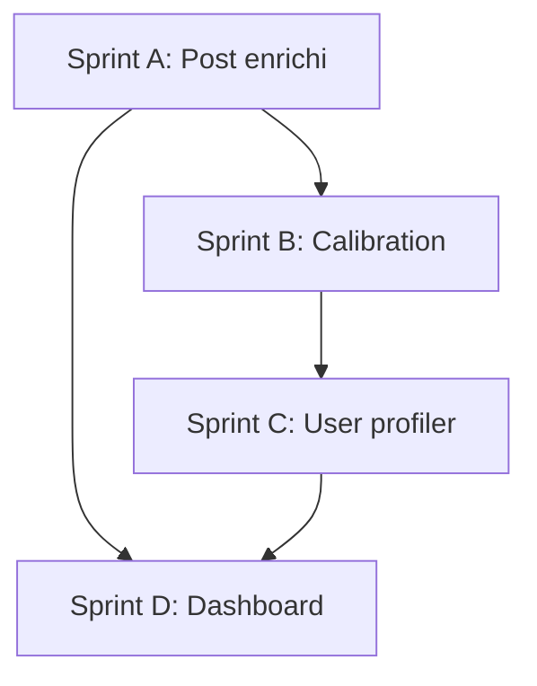

# Replan MVP — État au 28 mars 2026

## Ce qui existe déjà

### Capture (Phase 0-1 : ✅ terminé)
- 3 modes de capture fonctionnels (AccessibilityService, ADB, Capacitor)
- Sessions collectées dans `data/` (JSON)
- Logcat listener temps réel
- Auto-scroll + screenshot + dump UI
- Device configuré (OnePlus Nord CE 3 Lite)

### Stockage (Phase 0-1 : ✅ terminé)
- Prisma + SQLite (`echa.db`)
- Modèle `Session` + `Post` + `PostSemantic`
- Pipeline d'ingestion `ingest-all.ts`
- Migrations fonctionnelles

### Analyse basique (Phase 3 : 🔶 partiel)
- `analyzer.ts` : extraction posts depuis noeuds bruts
- 16 catégories regex (actualités, gaming, mode, tech, etc.)
- Calcul dwell time + attention levels
- Rapport texte + JSON analysis

### Visualisation (Phase 7 : 🔶 embryon)
- Dashboard debug (6 panneaux) sur `localhost:3000`
- API REST basique (sessions, posts, stats)
- WebSocket live ingest

## Écarts avec la Roadmap MVP

### PostSemantic actuel vs `post_enriched` cible

| Champ cible Roadmap | État actuel |
|---------------------|-------------|
| `normalized_text` | ❌ pas de consolidation caption+OCR+transcript |
| `semantic_summary` | 🔶 `PostSemantic.summary` existe, vide |
| `main_topics` / `secondary_topics` | 🔶 catégorie regex unique, pas multi-label |
| `persons`, `organizations`, `political_actors` | ❌ pas d'extraction d'entités |
| `tone`, `primary_emotion` | 🔶 `sentiment` (positive/neutral/negative) basique |
| `political_explicitness_score` (0-4) | ❌ inexistant |
| `polarization_score` (0-1) | ❌ inexistant |
| `narrative_frame` | ❌ inexistant |
| `call_to_action_type` | ❌ inexistant |
| `confidence_score` | 🔶 existe dans PostSemantic |

### Niveau utilisateur : 100% à construire
- Aucun agrégat utilisateur
- Pas de profil de consommation
- Pas de fenêtres temporelles

## Plan révisé

### Sprint A — Compléter le modèle post enrichi (1 semaine)

**Objectif** : faire évoluer `PostSemantic` → `post_enriched` complet

1. **Étendre le schéma Prisma**
   - Ajouter les champs manquants dans `PostSemantic` ou créer un modèle `PostEnriched`
   - Champs : `normalized_text`, `main_topics` (JSON), `secondary_topics` (JSON), `content_domain`, `persons` (JSON), `organizations` (JSON), `political_actors` (JSON), `tone`, `primary_emotion`, `emotion_intensity`, `political_explicitness_score` (Int 0-4), `polarization_score` (Float 0-1), `ingroup_outgroup_signal` (Bool), `conflict_signal` (Bool), `moral_absolute_signal` (Bool), `enemy_designation_signal` (Bool), `narrative_frame`, `call_to_action_type`, `review_flag` (Bool)

2. **Implémenter la couche 1 (règles)**
   - Dictionnaires : hashtags militants, institutions FR, partis politiques, élus, vocabulaire conflictuel, slogans
   - Scoring politique rule-based (présence d'entités politiques, hashtags militants)
   - Scoring polarisation rule-based (vocabulaire de conflit, indignation, opposition binaire)

3. **Implémenter la couche 2 (LLM)**
   - Abstraction `LLMProvider` (OpenAI, Ollama, local)
   - Prompt structuré pour enrichissement multi-label d'un post
   - Résumé, classification thématique, narratif, portée politique, explication du score
   - Batch processing avec rate limiting

4. **Consolidation**
   - Fusionner caption + OCR (`imageDesc`) + `allText` → `normalized_text`
   - Merger résultats règles + LLM → scores finaux
   - Tests sur échantillon (20-50 posts)

### Sprint B — Calibration post (0.5 semaine)

1. Annoter manuellement 50-100 posts depuis les sessions existantes
2. Comparer scores système vs annotation
3. Ajuster seuils et dictionnaires
4. Flags `review_flag` pour cas ambigus
5. Rapport de calibration

### Sprint C — Modèle et pipeline utilisateur (1 semaine)

1. **Nouveau modèle Prisma `UserProfile`**
   - `user_id`, `window` (7d/30d/90d), `computed_at`
   - `topic_distribution` (JSON), `top_5_topics` (JSON)
   - `topic_entropy` (Float), `single_topic_dominance` (Bool)
   - `political_content_share` (Float), `avg_political_explicitness` (Float)
   - `avg_polarization_score` (Float), `high_polarization_share` (Float)
   - `top_narratives` (JSON), `narrative_concentration` (Float)
   - `top_authors` (JSON), `source_concentration_index` (Float)
   - `content_diversity_index` (Float)
   - `consumption_profile` (String) — un des 10 profils définis

2. **Pipeline d'agrégation `src/user-profiler.ts`**
   - Charger posts enrichis par viewer/user + fenêtre temporelle
   - Calculer distributions thématiques (Shannon entropy)
   - Calculer parts politique/polarisation
   - Calculer concentration sources
   - Affecter profil de consommation (règles transparentes)

3. **Tests** sur données réelles

### Sprint D — Dashboard enrichi + documentation (1 semaine)

1. **Vue fiche post enrichie**
   - Scores politiques + polarisation visuels
   - Narratif + entités
   - Confiance + flag review

2. **Vue fiche utilisateur**
   - Distribution thématique (chart)
   - Indicateurs politique/polarisation
   - Profil de consommation
   - Fenêtres 7j/30j/90j

3. **Vue population**
   - Segmentation par profil
   - Filtres (thème, score politique, polarisation)
   - Exports CSV/JSON

4. **Documentation**
   - Taxonomie et méthodologie
   - Limites et gouvernance
   - Guide de lecture métier

## Dépendances techniques

## Choix LLM recommandé

| Usage | Modèle | Coût estimé |
|-------|--------|-------------|
| Enrichissement post (batch) | GPT-4o-mini ou Llama 3 local | ~$0.001/post |
| Résumé + classification | GPT-4o-mini | ~$0.002/post |
| Fallback local | Ollama + Llama 3.1 8B | gratuit |

Budget estimé pour 1000 posts : ~$3-5 via API, $0 en local.

## Prochaine action

**Commencer par Sprint A, tâche 1** : étendre le schéma Prisma pour couvrir le spec `post_enriched` complet.
