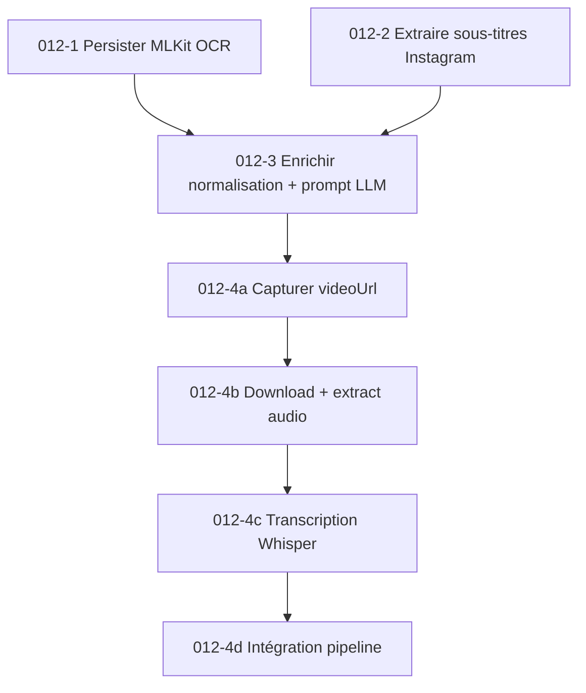
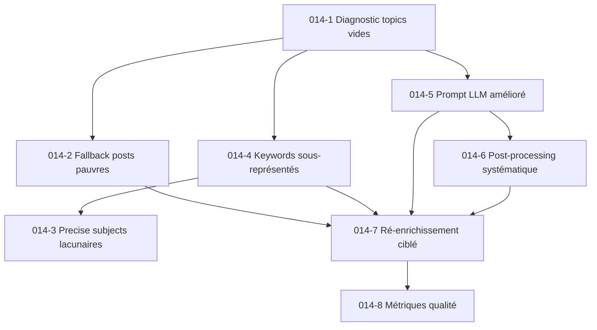
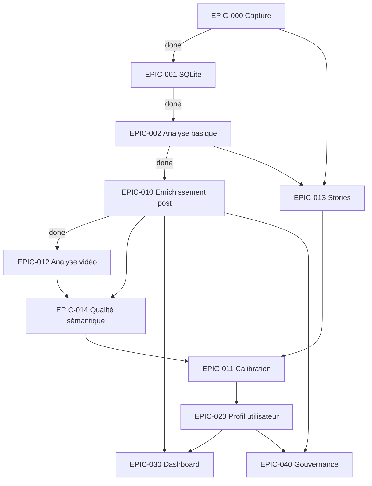

# ECHA — Roadmap Epics & Tasks

> Source de vérité pour le suivi d'avancement. Chaque epic correspond à un sprint du replan.
> Statuts : `done` | `in-progress` | `todo` | `blocked`

---

## EPIC-000 : Infrastructure de capture
**Statut** : `done`
**Description** : Capturer l'activité Instagram brute depuis un device Android.

| # | Tâche | Statut | Notes |
|---|-------|--------|-------|
| 000-1 | AccessibilityService Java (APK) | done | Logcat ECHA_DATA |
| 000-2 | Scripts ADB (dump UI, screenshot, auto-scroll) | done | `auto-capture.ts` |
| 000-3 | WebView Capacitor (tracker.js) | done | DOM parsing + IntersectionObserver |
| 000-4 | Logcat listener temps réel | done | `logcat-tap.ts` |
| 000-5 | Scan devices + WiFi ADB | done | `scan-devices.ts` |

---

## EPIC-001 : Data layer SQLite
**Statut** : `done`
**Description** : Stocker sessions et posts dans SQLite via Prisma.

| # | Tâche | Statut | Notes |
|---|-------|--------|-------|
| 001-1 | Schéma Prisma (Session, Post, PostSemantic) | done | `prisma/schema.prisma` |
| 001-2 | Pipeline ingestion _analysis.json → SQLite | done | `db/ingest.ts` |
| 001-3 | Auto-ingest depuis analyzer.ts | done | |
| 001-4 | Batch ingest-all.ts | done | |
| 001-5 | Visualizer debug (dashboard 6 panneaux) | done | `src/visualizer/` |

---

## EPIC-002 : Analyse basique posts
**Statut** : `done`
**Description** : Extraire et catégoriser les posts depuis les sessions brutes.

| # | Tâche | Statut | Notes |
|---|-------|--------|-------|
| 002-1 | Extraction posts depuis noeuds bruts | done | `analyzer.ts` |
| 002-2 | 16 catégories regex (2 passes) | done | primary + secondary blob |
| 002-3 | Calcul dwell time + attention levels | done | skipped/glanced/viewed/engaged |
| 002-4 | Rapport texte + JSON analysis | done | `_report.txt` + `_analysis.json` |

---

## EPIC-010 : Enrichissement post complet (`post_enriched`)
**Statut** : `done`
**Description** : Transformer chaque post brut en unité d'analyse sémantique et politique conforme au spec roadmap §6.

### Tâche 010-1 : Extension schéma Prisma
**Statut** : `done`

Étendre `PostSemantic` ou créer `PostEnriched` avec tous les champs cibles :
- `normalized_text` (consolidation caption+OCR+allText)
- `main_topics`, `secondary_topics` (JSON, multi-label)
- `content_domain`, `audience_target`
- `persons`, `organizations`, `political_actors` (JSON, entités nommées)
- `tone`, `primary_emotion`, `emotion_intensity`
- `political_explicitness_score` (Int 0-4)
- `political_issue_tags`, `public_policy_tags` (JSON)
- `institutional_reference_score` (Float)
- `activism_signal` (Bool)
- `polarization_score` (Float 0-1)
- `ingroup_outgroup_signal`, `conflict_signal`, `moral_absolute_signal`, `enemy_designation_signal` (Bool)
- `narrative_frame` (enum/string)
- `call_to_action_type` (enum/string)
- `problem_solution_pattern` (String)
- `confidence_score` (Float)
- `review_flag` (Bool)

### Tâche 010-2 : Dictionnaires et règles (couche 1)
**Statut** : `done`

Créer `src/enrichment/dictionaries/` :
- `political-actors.ts` — partis, élus, institutions FR
- `militant-hashtags.ts` — hashtags militants, causes, slogans
- `conflict-vocabulary.ts` — vocabulaire polarisant, indignation, opposition
- `topics-keywords.ts` — mots-clés par thème de la taxonomie (24 thèmes)

Créer `src/enrichment/rules-engine.ts` :
- Scoring politique rule-based (présence entités → score 0-4)
- Scoring polarisation rule-based (densité vocabulaire conflictuel → 0-1)
- Détection narratif simple (patterns textuels)

### Tâche 010-3 : Abstraction LLM + prompts (couche 2)
**Statut** : `done`

Créer `src/enrichment/llm/` :
- `provider.ts` — interface `LLMProvider` (call, models, cost)
- `openai.ts` — implémentation OpenAI (GPT-4o-mini)
- `ollama.ts` — implémentation Ollama (Llama 3 local)
- `prompts.ts` — prompt structuré pour enrichissement post :
  - résumé sémantique
  - classification multi-label (24 thèmes)
  - narratif (14 types)
  - portée politique (0-4) + justification
  - polarisation (0-1) + signaux détectés
  - entités nommées
  - appel à l'action (11 types)
  - confiance

### Tâche 010-4 : Consolidation texte (couche 4)
**Statut** : `done`

Créer `src/enrichment/normalize.ts` :
- Fusion caption + imageDesc (alt-text Instagram) + allText
- Nettoyage (emojis, mentions, URLs, whitespace)
- Détection langue
- Production `normalized_text`

### Tâche 010-5 : Pipeline d'enrichissement batch
**Statut** : `done`

Créer `src/enrichment/pipeline.ts` :
- Charger posts non enrichis depuis SQLite
- Pour chaque post : normalize → rules → LLM → merge → persist
- Rate limiting + retry
- Logs d'erreur + monitoring
- Mode batch (toute la base) + mode incrémental (nouveaux posts)

Script CLI : `src/enrich.ts` (entry point)

### Tâche 010-6 : Tests enrichissement
**Statut** : `done`

- Test unitaire dictionnaires (détection correcte entités politiques)
- Test unitaire rules-engine (scoring attendu sur posts exemples)
- Test intégration pipeline (20-50 posts réels → vérification sortie)

---

## EPIC-011 : Calibration post
**Statut** : `todo`
**Description** : Rendre les scores utilisables via annotation humaine et ajustement.

| # | Tâche | Statut | Notes |
|---|-------|--------|-------|
| 011-1 | Extraire 50-100 posts pour annotation | todo | Depuis sessions existantes |
| 011-2 | Créer format d'annotation + guide | todo | JSON avec score attendu par champ |
| 011-3 | Annoter manuellement | todo | Humain |
| 011-4 | Comparer scores système vs annotation | todo | Matrice confusion, accuracy |
| 011-5 | Ajuster seuils et dictionnaires | todo | Itérer |
| 011-6 | Flags review_flag pour cas ambigus | todo | |
| 011-7 | Rapport de calibration | todo | `docs/calibration-v1.md` |

---

## EPIC-020 : Profil utilisateur agrégé (`user_profile_mvp`)
**Statut** : `todo`
**Description** : Agréger les posts enrichis pour produire un profil de consommation par utilisateur.
**Dépend de** : EPIC-010, EPIC-011

### Tâche 020-1 : Modèle Prisma `UserProfile`
**Statut** : `todo`

- `user_id`, `window` (7d/30d/90d), `computed_at`
- `topic_distribution` (JSON), `top_5_topics` (JSON), `topic_entropy` (Float)
- `political_content_share`, `avg_political_explicitness`
- `avg_polarization_score`, `high_polarization_share`
- `top_narratives` (JSON), `narrative_concentration`
- `top_authors` (JSON), `source_concentration_index`
- `content_diversity_index`
- `consumption_profile` (String — 1 des 10 profils)

### Tâche 020-2 : Pipeline agrégation
**Statut** : `todo`

Créer `src/profiler/` :
- `aggregator.ts` — calcul distributions, entropies, concentrations
- `profiles.ts` — règles d'affectation profil (transparentes, documentées)
- `pipeline.ts` — load enriched posts → aggregate → derive profile → persist

### Tâche 020-3 : Tests profiler
**Statut** : `todo`

- Tests unitaires agrégation (distributions, entropy Shannon)
- Tests affectation profils (cas limites)
- Test intégration sur données réelles

---

## EPIC-030 : Dashboard enrichi
**Statut** : `todo`
**Description** : Rendre le système lisible et exploitable via dashboard web.
**Dépend de** : EPIC-010, EPIC-020

| # | Tâche | Statut | Notes |
|---|-------|--------|-------|
| 030-1 | Vue fiche post enrichie | todo | Scores, narratif, entités, confiance |
| 030-2 | Vue fiche utilisateur | todo | Distribution, indicateurs, profil, fenêtres |
| 030-3 | Vue population / segmentation | todo | Filtres thème/politique/polarisation |
| 030-4 | Exports CSV / JSON | todo | |
| 030-5 | API REST étendue | todo | Endpoints enrichissement + profils |

---

## EPIC-040 : Gouvernance et documentation
**Statut** : `done`
**Description** : Documenter limites, méthodologie, et sécuriser l'usage.

| # | Tâche | Statut | Notes |
|---|-------|--------|-------|
| 040-1 | Documentation taxonomie + méthodologie | done | `docs/TAXONOMY.md` |
| 040-2 | Note de gouvernance (limites, risques) | done | `docs/GOVERNANCE.md` — exposition ≠ conviction |
| 040-3 | Guide lecture métier | done | `docs/READING-GUIDE.md` |
| 040-4 | Versionnage taxonomies et scores | done | `src/enrichment/version.ts` + `docs/VERSIONING.md` |

---

## EPIC-012 : Analyse vidéo — Comprendre le message des médias
**Statut** : `done`
**Description** : Exploiter tous les signaux disponibles (OCR, sous-titres, transcription audio) pour comprendre le message et les intentions des vidéos/reels Instagram.
**Dépend de** : EPIC-010

### Contexte

Les vidéos/reels Instagram portent leur message sur 3 canaux actuellement sous-exploités :
1. **Texte incrusté / sous-titres** — MLKit OCR capturé via logcat mais jamais persisté
2. **Sous-titres Instagram auto** — présents dans l'arbre accessibilité, noyés dans `allText`
3. **Audio** — canal le plus riche, complètement absent de la pipeline

**État actuel** : les vidéos sont traitées identiquement aux photos par le pipeline d'enrichissement. Le `mediaType` est passé au LLM mais aucune logique spécifique n'existe.

### Tâche 012-1 : Persister les résultats MLKit OCR
**Statut** : `done`
**Priorité** : haute (quick win — données déjà capturées, jamais stockées)

**Problème** : `MLKitResult` (labels + ocrText) est émis par `logcat-tap.ts` via `this.emit('mlkit', data)` mais n'est rattaché à aucun post ni persisté dans les sessions.

**Implémentation** :
- [ ] Dans `capture.ts` : écouter l'event `mlkit` du LogcatTap, accumuler les résultats par `postId`
- [ ] Stocker `mlkitResults: Record<postId, MLKitResult[]>` dans le fichier session JSON
- [ ] Dans `analyzer.ts` : merger les `ocrText` MLKit dans le post correspondant (match par `postId`)
- [ ] Ajouter champ `ocrText` (String?) au modèle `Post` dans le schéma Prisma
- [ ] Dans `db/ingest.ts` : persister `ocrText` depuis l'analysis JSON
- [ ] Migration Prisma
- [ ] Test : capturer une session avec un reel contenant du texte overlay → vérifier que `ocrText` est non-null en base

**Fichiers impactés** : `logcat-tap.ts`, `capture.ts`, `analyzer.ts`, `db/ingest.ts`, `prisma/schema.prisma`

---

### Tâche 012-2 : Extraire les sous-titres Instagram de l'arbre accessibilité
**Statut** : `done`
**Priorité** : haute (quick win — données déjà dans les nodes, pas identifiées)

**Problème** : Instagram génère des sous-titres auto sur les reels. Ils apparaissent comme noeuds texte dans l'arbre accessibilité mais sont mélangés dans `allText` sans marquage.

**Implémentation** :
- [ ] Étudier les sessions existantes (`data/session_*.json`) pour identifier les patterns de noeuds sous-titres Instagram (resourceId, position dans l'arbre, texte caractéristique)
- [ ] Dans `analyzer.ts` : créer `extractSubtitles(nodes: RawNode[]): string | null` qui isole les noeuds sous-titres des reels
- [ ] Ajouter champ `subtitles` (String?) au modèle `Post` dans le schéma Prisma
- [ ] Persister dans `db/ingest.ts`
- [ ] Test : identifier un reel avec sous-titres auto dans les sessions existantes → vérifier extraction

**Fichiers impactés** : `analyzer.ts`, `db/ingest.ts`, `prisma/schema.prisma`

**Note** : cette tâche nécessite d'abord une phase d'exploration des données brutes pour comprendre la structure des sous-titres dans l'arbre UI.

---

### Tâche 012-3 : Enrichir la normalisation et le prompt LLM pour les vidéos
**Statut** : `done`
**Priorité** : haute (dépend de 012-1 et 012-2)
**Dépend de** : 012-1, 012-2

**Problème** : `normalizePostText()` ne consolide que caption + imageDesc + allText. Le prompt LLM ne distingue pas les vidéos des photos.

**Implémentation** :
- [ ] Dans `normalize.ts` : ajouter `ocrText` et `subtitles` comme sources de texte (4ème et 5ème source)
  - Déduplication avec `allText` (les sous-titres peuvent être en doublon)
  - Marquer la provenance : `[OCR] texte` / `[SUBTITLES] texte` pour que le LLM distingue
- [ ] Dans `prompts.ts` : enrichir le prompt pour les vidéos/reels :
  - Instruction spécifique quand `mediaType` est video/reel
  - Demander au LLM d'inférer le message principal du média en croisant : caption du créateur + texte overlay (OCR) + sous-titres + piste audio nommée
  - Ajouter champs de sortie LLM : `media_message` (string — message principal du média), `media_intent` (enum — informer|divertir|vendre|convaincre|émouvoir|éduquer|provoquer)
- [ ] Dans `pipeline.ts` : passer `ocrText` et `subtitles` au `normalizePostText()` et au `buildEnrichmentPrompt()`
- [ ] Ajouter champs `mediaMessage` (String?) et `mediaIntent` (String?) au modèle `PostEnriched`
- [ ] Migration Prisma
- [ ] Test : enrichir un post vidéo avec ocrText rempli → vérifier que `mediaMessage` et `mediaIntent` sont produits

**Fichiers impactés** : `normalize.ts`, `prompts.ts`, `pipeline.ts`, `prisma/schema.prisma`

---

### Tâche 012-4 : Pipeline transcription audio (Whisper)
**Statut** : `done`
**Priorité** : moyenne (nécessite du dev + infrastructure)
**Dépend de** : 012-3

**Problème** : l'audio est le canal le plus riche des vidéos mais aucun mécanisme d'extraction ou de transcription n'existe.

**Approche retenue** : extraction via `videoUrl` du WebView tracker → téléchargement → transcription Whisper (local ou API).

**Implémentation** :

#### 012-4a : Capturer et persister les videoUrl
- [ ] Dans `logcat-tap.ts` / `capture.ts` : le `TrackerEvent` contient déjà `videoUrl` dans l'interface — vérifier qu'il est bien rempli côté `tracker.js`
- [ ] Dans `tracker.js` (WebView) : extraire `videoUrl` depuis les éléments `<video>` du DOM Instagram
- [ ] Persister `videoUrl` dans le fichier session et dans le modèle `Post` (nouveau champ String?)
- [ ] Test : capturer un reel via WebView → vérifier que `videoUrl` est non-null

#### 012-4b : Télécharger et extraire l'audio
- [ ] Créer `src/media/download.ts` : télécharger la vidéo depuis `videoUrl` (CDN Instagram)
  - Gestion CORS/auth headers si nécessaire
  - Stockage temporaire dans `data/media/`
  - Timeout + retry
- [ ] Créer `src/media/audio-extract.ts` : extraire l'audio via ffmpeg (`ffmpeg -i video.mp4 -vn -acodec pcm_s16le audio.wav`)
  - Prérequis : ffmpeg installé localement
  - Nettoyage fichier vidéo après extraction

#### 012-4c : Transcription Whisper
- [ ] Créer `src/media/transcribe.ts` : abstraction `TranscriptionProvider`
  - Interface : `transcribe(audioPath: string): Promise<{ text: string; language: string; segments: Array<{ start: number; end: number; text: string }> }>`
  - Implémentation Whisper local (whisper.cpp ou openai/whisper via Python)
  - Implémentation Whisper API (OpenAI, ~$0.006/min)
  - Fallback : Deepgram API (tier gratuit 45h/mois)
- [ ] Ajouter champ `audioTranscription` (String?) au modèle `Post` ou `PostEnriched`
- [ ] Test : transcrire un reel en français → vérifier texte cohérent

#### 012-4d : Intégration dans la pipeline d'enrichissement
- [ ] Dans `pipeline.ts` ou nouveau `src/enrichment/media-pipeline.ts` :
  - Avant enrichissement LLM : si post.mediaType = video/reel ET videoUrl disponible → download → extract audio → transcribe
  - Injecter `audioTranscription` dans `normalizePostText()` comme 6ème source de texte
  - Marquer provenance : `[AUDIO_TRANSCRIPT] texte`
- [ ] Dans `enrich.ts` : ajouter flag `--with-audio` pour activer la transcription (désactivé par défaut, coûteux)
- [ ] Test intégration : pipeline complète sur 5 reels → vérifier que transcription enrichit le scoring

**Fichiers impactés** : `tracker.js`, `logcat-tap.ts`, `capture.ts`, `prisma/schema.prisma`, nouveau `src/media/`, `pipeline.ts`, `normalize.ts`, `enrich.ts`

**Prérequis** :
- ffmpeg installé sur la machine
- Whisper local (whisper.cpp) OU clé API OpenAI/Deepgram
- WebView Capacitor fonctionnel pour capturer les `videoUrl`

---

### Résumé des modifications schéma Prisma

```prisma
model Post {
  // ... existant ...
  ocrText      String?   // Texte détecté par MLKit (overlay/sous-titres brûlés)
  subtitles    String?   // Sous-titres Instagram auto-générés (extraits de l'arbre accessibilité)
  videoUrl     String?   // URL CDN de la vidéo (depuis WebView tracker)
}

model PostEnriched {
  // ... existant ...
  audioTranscription  String?   // Transcription audio Whisper
  mediaMessage        String?   // Message principal du média (inféré par LLM)
  mediaIntent         String?   // Intention du média (informer|divertir|vendre|convaincre|émouvoir|éduquer|provoquer)
}
```

### Ordre d'implémentation et dépendances



### Estimation effort

| Tâche | Effort | ROI |
|-------|--------|-----|
| 012-1 MLKit OCR | Faible — plomberie existante | Très élevé — données gratuites |
| 012-2 Sous-titres Instagram | Moyen — exploration données + patterns | Élevé — transcription gratuite |
| 012-3 Normalisation + prompt | Moyen — modification pipeline existante | Élevé — meilleure compréhension LLM |
| 012-4 Transcription audio | Élevé — nouveau sous-système | Très élevé — canal le plus riche |

---

## EPIC-013 : Support Stories Instagram
**Statut** : `done`
**Description** : Activer la capture, l'extraction et l'analyse des stories Instagram (AccessibilityService + analyzer).
**Dépend de** : EPIC-000, EPIC-002

### Contexte

Les stories étaient explicitement filtrées comme bruit de navigation dans :
- `NodeExtractor.java` : "story de" dans `isNavigationDesc()`
- `PostTracker.java` : pas de screenType "story"
- `analyzer.ts` : "story" dans `NOISE_WORDS`

Le WebView tracker (`tracker.js`) gérait déjà les stories via détection URL `/stories/username/`.

### Tâche 013-1 : Retirer les filtres anti-stories
**Statut** : `done`

- [x] `NodeExtractor.java` : retirer "story de" de `isNavigationDesc()` (garder "ajouter à la story" car c'est un bouton UI)
- [x] `analyzer.ts` : retirer "story" de `NOISE_WORDS`

### Tâche 013-2 : Détecter le screenType "story"
**Statut** : `done`

- [x] `PostTracker.java` → `scanForScreenType()` : ajouter détection "story" via desc "story de" ou resourceId "reel_viewer_title"

### Tâche 013-3 : Extraction de stories depuis l'arbre accessibilité
**Statut** : `done`

- [x] `analyzer.ts` : créer `extractStoriesFromNodes()` qui parse le pattern "Story de username, X sur Y"
- [x] Extraire : username, frame index/total, texte overlay, hashtags, mentions, sponsorisé, type vidéo
- [x] Intégrer dans la boucle `analyzeSession()` quand `screenType === 'story'`
- [x] Ajouter `story` et `story_video` aux mediaTypes de `ExtractedPost`

### Tâche 013-4 : Tests
**Statut** : `done`

- [x] Test pattern matching stories (4 cas)
- [x] Test NOISE_WORDS ne filtre plus "story" (2 cas)

**Fichiers modifiés** : `NodeExtractor.java`, `PostTracker.java`, `analyzer.ts`
**Fichiers créés** : `src/__tests__/story-extraction.test.ts`

---

## EPIC-014 : Qualité sémantique — Dimension par post et détection de thèmes
**Statut** : `todo`
**Description** : Améliorer la qualité et la profondeur de l'analyse sémantique par post. Réduire le taux de topics vides, enrichir la taxonomie sur les thèmes sous-représentés, et fiabiliser la détection de thèmes pour que les dashboards soient exploitables.
**Dépend de** : EPIC-010, EPIC-012

### Contexte et diagnostic (2026-03-28)

Données factuelles sur 155 posts enrichis :
- **26% de posts enrichis avec mainTopics vide** (40/155) — inacceptable pour un dashboard
- **Confidence moyenne : 0.68** — correcte mais insuffisante pour les posts pauvres en texte
- **Distribution très déséquilibrée** : divertissement (64), culture (51) captent 74% des posts. 12 thèmes sur 24 ont < 3 occurrences
- **5 thèmes sans aucun precise subject** : culture, divertissement, sport, beauté, dev_perso
- **49 posts enrichis rules-only** (32%) → ces posts ont confiance réduite (×0.6) et topics souvent vides
- **Post-processing ad hoc** : correction boardgame sport→divertissement codée en dur dans pipeline.ts

### Tâche 014-1 : Diagnostic approfondi — profiler les posts à topics vides
**Statut** : `todo`
**Priorité** : haute (pré-requis pour cibler les corrections)

**Objectif** : Comprendre POURQUOI 40 posts enrichis ont des topics vides.

**Implémentation** :
- [ ] Script `scripts/diagnose-empty-topics.ts` : pour chaque post avec mainTopics=[], extraire :
  - `normalizedText` (longueur, langue)
  - `provider` (rules vs LLM)
  - `mediaType` (photo/video/reel/story)
  - `username` (pattern de comptes récurrents)
  - `confidenceScore`
  - Le texte brut (caption, allText) pour comprendre si le contenu est classifiable
- [ ] Produire un rapport catégorisé : texte insuffisant | LLM n'a pas renvoyé de topics | rules-engine n'a pas matché | bug pipeline
- [ ] Identifier les patterns récurrents : comptes sans caption, reels purement visuels, stories textuelles, etc.

**Sortie** : `data/diagnostic-empty-topics.json` + rapport console

---

### Tâche 014-2 : Fallback intelligent pour posts à texte pauvre
**Statut** : `todo`
**Priorité** : haute (quick win — réduit le taux de topics vides)

**Problème** : Les posts sans caption (reels, stories) ou avec caption très courte passent le seuil minimum (10 chars, 3 mots) mais n'ont pas assez de signal pour le rules-engine, et le LLM n'a pas de matière.

**Implémentation** :
- [ ] Dans `pipeline.ts` : pour les posts à texte pauvre (< 50 chars significatifs) + topics vides après rules :
  - Utiliser `username` comme signal principal (créer `dictionaries/account-domains.ts` : mapping comptes connus → domaines/thèmes)
  - Utiliser `mediaType` comme indice secondaire (reel sans texte = probable divertissement)
  - Utiliser `mlkitLabels` si disponibles (mapping labels ML Kit → thèmes)
  - Utiliser `imageUrls` : si vision activée, forcer le passage en vision pour ces posts
- [ ] Créer `src/enrichment/dictionaries/account-domains.ts` :
  - Mapping `username → { themes: string[], confidence: number }` pour les comptes fréquents du dataset
  - Extraction semi-automatique : analyser les posts enrichis avec bons topics, agréger par username
- [ ] Ajouter une étape `inferFromContext()` dans le pipeline entre rules et LLM
- [ ] Test : ré-enrichir 10 posts à topics vides → vérifier que le fallback produit des topics cohérents

**Fichiers impactés** : `pipeline.ts`, nouveau `dictionaries/account-domains.ts`

---

### Tâche 014-3 : Enrichir la taxonomie — precise subjects pour thèmes lacunaires
**Statut** : `todo`
**Priorité** : moyenne (profondeur sémantique — requis pour le site "89 dimensions")

**Problème** : 5 thèmes n'ont aucun precise subject, ce qui empêche le matching cross-perspectives et appauvrit l'analyse :
- `culture` (5 subjects, 0 precise) — musique, cinéma, art, littérature, patrimoine
- `divertissement` (4 subjects, 0 precise) — jeux vidéo, jeux de société, streaming, contenus viraux
- `sport` (5 subjects, 0 precise) — football, JO, dopage, e-sport, sport féminin
- `beaute` (3 subjects, 0 precise) — standards, industrie cosmétique, chirurgie esthétique
- `developpement_personnel` (3 subjects, 0 precise) — coaching, productivité, bien-être mental

**Implémentation** :
- [ ] Pour chaque thème, ajouter 2-4 precise subjects (propositions débattables typiques Instagram) :
  - `culture` : "Le cinéma français est en déclin", "Le streaming tue la musique", "L'IA menace la création artistique"
  - `divertissement` : "Les jeux vidéo rendent violent", "Le streaming remplace la TV traditionnelle", "Les réseaux sociaux sont addictifs"
  - `sport` : "L'e-sport est un vrai sport", "Le dopage est inévitable au haut niveau", "Le sport féminin est sous-médiatisé"
  - `beaute` : "Les standards de beauté sur Instagram sont toxiques", "La chirurgie esthétique devrait être mieux encadrée"
  - `developpement_personnel` : "Le coaching est souvent du charlatanisme", "La productivité est une injonction toxique"
- [ ] Ajouter des `knownPositions` avec narratifs et acteurs typiques pour chaque precise subject
- [ ] Test : vérifier que `getPreciseSubjectsForTheme()` retourne les nouveaux PS

**Fichiers impactés** : `dictionaries/taxonomy.ts`

---

### Tâche 014-4 : Élargir les keywords des thèmes sous-représentés
**Statut** : `todo`
**Priorité** : haute (améliore directement le rules-engine)

**Problème** : Les thèmes avec peu de matchs (religion: 0, masculinite: 0, identite: 0, business: 0 dans le dataset) ont peut-être des keywords trop étroits ou trop spécialisés pour le contenu Instagram typique.

**Implémentation** :
- [ ] Analyser les posts classés "divertissement" ou "culture" qui pourraient être mieux classés :
  - Posts avec hashtags food/cuisine/voyage → vérifier que lifestyle matche
  - Posts avec contenu religion/spiritualité → vérifier les keywords
  - Posts business/entrepreneuriat → vérifier matchs
- [ ] Enrichir les keywords des subjects pour chaque thème sous-représenté :
  - `religion` : ajouter termes Instagram courants (spiritualité, méditation guidée, halal, casher, prière, ramadan, noël, pâques)
  - `business` : ajouter vocabulaire entrepreneurial Instagram (side hustle, dropshipping, formation, mastermind, freelance, personal branding)
  - `identite` : ajouter termes identitaires courants (communauté, représentation, fierté, roots, diaspora, origines)
  - `masculinite` : ajouter signaux (alpha, sigma, grindset, redpill, mode homme, musculation)
- [ ] Ajouter des aliases LLM manquants dans `TOPIC_ALIASES` de `topics-keywords.ts` :
  - `spiritualité` → `religion`
  - `entrepreneuriat` → `business`
  - `startup` → `business`
  - `fitness` → `sport`
  - `wellness` → `sante`
  - `self-care` → `developpement_personnel`
- [ ] Test : relancer le rules-engine sur le dataset complet → vérifier que les thèmes sous-représentés gagnent en couverture

**Fichiers impactés** : `dictionaries/taxonomy.ts`, `dictionaries/topics-keywords.ts`

---

### Tâche 014-5 : Améliorer le prompt LLM — réduire les topics vides
**Statut** : `todo`
**Priorité** : haute (le LLM est la source principale de topics pour 68% des enrichis)

**Problème** : Le LLM retourne parfois `main_topics: []` ou un topic non canonique qui est rejeté par `normalizeTopics()`. Le prompt actuel liste les 24 thèmes inline dans une longue chaîne, ce qui peut être perdu dans le contexte.

**Implémentation** :
- [ ] Dans `prompts.ts` : restructurer le prompt pour rendre les thèmes plus saillants :
  - Séparer la liste des thèmes dans un bloc dédié (pas inline dans la description du champ)
  - Ajouter des exemples concrets par thème (1-2 mots-clés Instagram typiques)
  - Ajouter une instruction explicite : "main_topics ne doit JAMAIS être vide — même un post très pauvre a un domaine identifiable"
  - Ajouter un fallback dans l'instruction : "Si le texte est trop court pour classifier, utilise le nom d'utilisateur et le type de média comme indices"
- [ ] Dans `prompts.ts` : ajouter `secondary_topics` instruction plus forte : "Remplis dès qu'un thème secondaire est détectable. Un post de food peut aussi être lifestyle. Un post politique peut aussi être humour."
- [ ] Dans `pipeline.ts` : ajouter une validation post-LLM : si `main_topics` est vide après normalisation, logger un warning et tenter un retry avec un prompt simplifié, ou fallback sur rules
- [ ] Test : enrichir 20 posts avec le nouveau prompt → vérifier réduction du taux de topics vides

**Fichiers impactés** : `llm/prompts.ts`, `pipeline.ts`

---

### Tâche 014-6 : Post-processing systématique des topics LLM
**Statut** : `todo`
**Priorité** : moyenne (remplace le hack boardgame ad hoc par un système extensible)

**Problème** : `postProcessLLMTopics()` dans pipeline.ts est un hack ad hoc pour le cas boardgame→sport. Ce pattern va se reproduire pour d'autres domaines.

**Implémentation** :
- [ ] Créer `src/enrichment/topic-corrections.ts` — système de règles de correction :
  ```ts
  interface TopicCorrectionRule {
    name: string;
    signals: string[];          // mots-clés dans username+text déclenchant la règle
    replacements: Record<string, string>;  // topic_source → topic_corrigé
    addTopics?: string[];       // topics à ajouter si absents
  }
  ```
- [ ] Migrer la règle boardgame existante + ajouter d'autres cas connus :
  - Fitness accounts classés "sport" → garder sport mais ajouter "lifestyle"
  - Food accounts classés "lifestyle" seul → ajouter "culture" si contenu gastronomique
  - Comptes média (journalistes, rédactions) → ajouter "actualite" si absent
  - Comptes beauté/mode → normaliser beaute vs lifestyle
- [ ] Appeler `applyTopicCorrections()` dans pipeline.ts à la place de `postProcessLLMTopics()`
- [ ] Test : vérifier que les corrections existantes passent + nouvelles règles

**Fichiers impactés** : nouveau `enrichment/topic-corrections.ts`, `pipeline.ts` (remplacer `postProcessLLMTopics`)

---

### Tâche 014-7 : Script de ré-enrichissement ciblé
**Statut** : `todo`
**Priorité** : haute (après 014-2 à 014-5, il faut appliquer les améliorations au dataset existant)

**Problème** : Les 155 posts déjà enrichis ne bénéficieront pas des améliorations sans ré-enrichissement.

**Implémentation** :
- [ ] Créer `scripts/re-enrich.ts` :
  - Flag `--empty-topics` : ré-enrichir uniquement les posts avec mainTopics=[]
  - Flag `--rules-only-upgrade` : ré-enrichir les 49 posts rules-only avec LLM
  - Flag `--low-confidence` : ré-enrichir les posts avec confidenceScore < 0.5
  - Flag `--all` : tout ré-enrichir (destructif, demande confirmation)
  - Supprime l'entrée PostEnriched existante avant de ré-enrichir
  - Affiche un diff avant/après pour validation
- [ ] Test : ré-enrichir 5 posts à topics vides → vérifier amélioration

**Fichiers impactés** : nouveau `scripts/re-enrich.ts`, réutilise `enrichment/pipeline.ts`

---

### Tâche 014-8 : Métriques de qualité sémantique
**Statut** : `todo`
**Priorité** : moyenne (monitoring continu pour éviter la régression)

**Problème** : Pas de visibilité automatique sur la qualité de l'enrichissement. On ne découvre les topics vides qu'en inspectant manuellement la DB.

**Implémentation** :
- [ ] Ajouter au visualizer (`src/visualizer/api.ts`) un endpoint `/api/enrichment-quality` :
  - Taux de topics vides (mainTopics=[])
  - Distribution des confidenceScore (histogramme)
  - Taux de reviewFlag
  - Couverture des thèmes (combien de thèmes ont > 5 posts)
  - Ratio rules-only vs LLM-enriched
  - Top 10 usernames avec le plus de topics vides
- [ ] Ajouter au daemon (`src/enrichment/daemon.ts`) : log de qualité après chaque batch :
  - `[daemon] Quality: 85% topics OK, avg conf 0.72, 2 review flags`
- [ ] Test : vérifier endpoint retourne les bonnes métriques

**Fichiers impactés** : `visualizer/api.ts`, `enrichment/daemon.ts`

---

### Résumé des améliorations attendues

| Métrique | Avant | Cible après EPIC-014 |
|----------|-------|---------------------|
| Posts avec mainTopics vide | 26% (40/155) | < 5% |
| Confidence moyenne | 0.68 | > 0.75 |
| Thèmes avec > 5 posts | 5/24 (21%) | > 12/24 (50%) |
| Precise subjects totaux | 48 | > 60 |
| Correction topics ad hoc | 1 hardcodée | Système extensible |
| Monitoring qualité | aucun | Endpoint + logs daemon |

### Ordre d'exécution



### Estimation effort

| Tâche | Effort | Impact |
|-------|--------|--------|
| 014-1 Diagnostic | Faible | Déblocage — éclaire toutes les autres tâches |
| 014-2 Fallback posts pauvres | Moyen | Très élevé — réduit topics vides de 50%+ |
| 014-3 Precise subjects | Faible | Moyen — profondeur sémantique |
| 014-4 Keywords élargis | Moyen | Élevé — meilleure couverture rules-engine |
| 014-5 Prompt LLM | Moyen | Très élevé — source principale de topics |
| 014-6 Post-processing | Faible | Moyen — maintenabilité |
| 014-7 Ré-enrichissement | Moyen | Très élevé — applique les gains au dataset |
| 014-8 Métriques | Faible | Élevé — monitoring continu |

---

## Dépendances



## Changelog
- 2026-03-28 : ajout EPIC-014 qualité sémantique (diagnostic, fallback, taxonomie, prompt, ré-enrichissement, métriques)
- 2026-03-28 : ajout EPIC-013 support Stories Instagram (filtres retirés, détection story, extraction)
- 2026-03-28 : ajout EPIC-012 analyse vidéo (OCR, sous-titres, transcription audio, prompt LLM enrichi)
- 2026-03-28 : création du système epic/task, migration depuis ROADMAP.md + REPLAN.md
