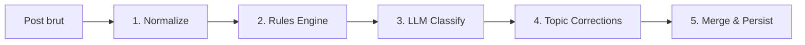

# Scrollout — Taxonomie & Methodologie

> Documentation de reference du systeme de classification semantique et politique.
> Version : 1.0 — 2026-03-28

---

## 1. Vue d'ensemble

Scrollout analyse les posts Instagram captures pour produire un **enrichissement semantique multi-dimensionnel**. Le pipeline combine deux couches complementaires :

1. **Rules Engine** — classification deterministe par dictionnaires (rapide, gratuite, reproductible)
2. **LLM** — classification fine par modele de langage (nuancee, contextuelle, couteuse)

Les resultats sont fusionnes, valides, puis persistes dans le modele `PostEnriched` (45 champs).

---

## 2. Taxonomie 5 niveaux

La taxonomie est hierarchique. Chaque post est classifie a plusieurs niveaux simultanement.

### Niveau 1 — Domaines (7)

Macro-categories pour l'agregation profil utilisateur.

| Domaine | Themes inclus |
|---------|---------------|
| Politique & Societe | politique, geopolitique, immigration, securite, justice, societe, feminisme, masculinite, identite |
| Economie & Travail | economie, business |
| Information & Savoirs | actualite, education, technologie, sante |
| Culture & Divertissement | culture, humour, divertissement, sport |
| Lifestyle & Bien-etre | lifestyle, beaute, developpement_personnel |
| Ecologie & Environnement | ecologie |
| Religion & Spiritualite | religion |

### Niveau 2 — Themes (24)

Classification multi-label principale. Chaque post recoit 1-3 themes principaux et 0-3 themes secondaires.

```
actualite, politique, geopolitique, economie, ecologie, immigration,
securite, justice, sante, religion, education, culture, humour,
divertissement, lifestyle, beaute, sport, business,
developpement_personnel, technologie, feminisme, masculinite,
identite, societe
```

### Niveau 3 — Sujets (~150)

Sous-categories stables rattachees a un theme. Exemples :

| Theme | Sujets |
|-------|--------|
| politique | elections, assemblee_nationale, presidentielle, reformes, fiscalite, institutions |
| immigration | politique_migratoire, integration, asile, sans_papiers, frontieres |
| ecologie | climat, biodiversite, energie, pollution, agriculture |
| sante | systeme_de_sante, vaccination, sante_mentale, alimentation |
| economie | inflation, emploi, pouvoir_achat, dette_publique, retraites |

### Niveau 4 — Sujets precis (variable)

Propositions debattables permettant de mesurer les positions. Chaque sujet precis a :
- Un **id** unique
- Un **enonce** (proposition debattable)
- Des **positions connues** (pour/contre, avec acteurs associes)

Exemples :
- `vote_obligatoire` : "Le vote devrait etre obligatoire en France"
  - Pour : institutionnalistes — Contre : libertariens
- `49_3_legitime` : "Le recours au 49.3 est anti-democratique"
  - Pour : LFI, RN — Contre : Renaissance
- `rn_republicanise` : "Le RN est devenu respectable"
  - Pour : conservateurs — Contre : antifascistes

### Niveau 5 — Marqueurs & Entites (dynamique)

Detectes automatiquement dans le texte :
- **Acteurs politiques** : personnalites, partis, institutions
- **Personnes** : noms propres non politiques
- **Organisations** : medias, ONG, entreprises
- **Pays** : references geographiques

---

## 3. Dictionnaires

Huit dictionnaires alimentent le Rules Engine.

### 3.1 Acteurs politiques (`political-actors.ts`)

| Categorie | Cardinalite | Exemples |
|-----------|-------------|----------|
| Partis | ~25 | LFI, RN, PS, Renaissance, EELV, PCF |
| Personnalites | ~25 | Macron, Melenchon, Le Pen, Bardella, Attal |
| Institutions | ~30 | Assemblee nationale, Senat, Elysee, Matignon |
| Termes activisme | ~20 | manifestation, greve, petition, militant, boycott |

**Matching** : word boundary pour termes <= 3 caracteres, substring pour les autres.

### 3.2 Comptes Instagram politiques (`political-accounts.ts`)

~20 comptes avec score politique minimum et tags thematiques.

| Compte | Score min | Tags |
|--------|-----------|------|
| @mediapart | 2 | politique, investigation |
| @emmanuelmacron | 3 | politique, executif |
| @mathildelarrere | 3 | histoire, politique, gauche |
| @hugodecrypte | 1 | actualite, vulgarisation |

### 3.3 Axes political compass (`political-axes.ts`)

4 axes bipolaires, chacun score de -1 a +1 :

| Axe | Pole negatif (-1) | Pole positif (+1) |
|-----|-------------------|-------------------|
| Economique | Gauche : redistribution, services publics, anti-capitalisme | Droite : libre marche, privatisation, entrepreneuriat |
| Societal | Progressiste : LGBTQ+, feminisme, IVG | Conservateur : tradition, famille, anti-woke |
| Autorite | Libertaire : libertes civiles, vie privee, decentralisation | Autoritaire : ordre, police, surveillance |
| Systeme | Anti-systeme : conspiration, revolution, democratie directe | Institutionnel : reformes, institutions, UE |

**Calcul** : `score = (matches_positifs - matches_negatifs) / total_matches`, normalise a [-1, +1].

### 3.4 Hashtags militants (`militant-hashtags.ts`)

| Type | Cardinalite | Exemples |
|------|-------------|----------|
| Politiques | ~60 | #justiceclimatique, #greve, #metoo, #freepalestine, #nwo |
| Societaux | ~20 | #bienetre, #sante, #education, #logement, #salaire |

**Scoring** :
- >= 3 hashtags politiques → score 4 (militant)
- >= 1 hashtag politique → score 3 (explicitement politique)
- >= 2 hashtags societaux → score 2
- >= 1 hashtag societal → score 1

### 3.5 Vocabulaire conflictuel (`conflict-vocabulary.ts`)

6 categories ponderees pour le calcul de polarisation :

| Categorie | Poids | Exemples |
|-----------|-------|----------|
| Opposition binaire | 0.25 | "les elites", "nous vs eux", "le peuple" |
| Absolu moral | 0.20 | "genocide", "fascisme", "bien vs mal" |
| Termes de conflit | 0.20 | "guerre", "ennemi", "combat", "detruire" |
| Indignation | 0.15 | "scandale", "honte", "intolerable", "ras-le-bol" |
| Simplification causale | 0.10 | "a cause de", "la faute de", "ouvrez les yeux" |
| Designation d'ennemi | 0.10 | "ennemi du peuple", "danger", "hors de France" |

### 3.6 Categories media (`media-category.ts`)

| Categorie | Qualite associee |
|-----------|-----------------|
| divertissement | neutre |
| information | factuel |
| opinion | emotionnel |
| intox | trompeur, sensationnel |
| pub | emotionnel |
| education | factuel |

### 3.7 Mots-cles par theme (`topics-keywords.ts`)

24 ensembles de mots-cles (un par theme) + 40+ alias de normalisation.

---

## 4. Scores et metriques

### 4.1 Score d'explicite politique (0-4)

Mesure le **degre de contenu politique** du post, pas l'opinion de l'auteur.

| Score | Label | Definition | Exemples |
|-------|-------|------------|----------|
| 0 | Apolitique | Aucun lien avec la sphere publique | Beaute, food, gaming, sport |
| 1 | Social | Sujet social/culturel sans enjeu public clair | Wellness, dev perso vague |
| 2 | Indirect | Enjeu public sans militantisme | Economie, sante publique |
| 3 | Explicite | Sujet politique nomme | Elections, partis, lois |
| 4 | Militant | Appel a l'action, propagande, mobilisation | Slogans, manifestations |

**Calcul** (Rules Engine) :
1. Base = score hashtags (0-4)
2. Si personnalites ou partis detectes → min 3
3. Si >= 2 institutions → min 2
4. Si >= 2 termes activisme → score 4
5. Si theme politique (politique, geopolitique, immigration, securite, justice, ecologie) → min 2
6. Si compte Instagram connu → min = score du compte
7. Final = min(score, 4)

**Fusion** : `max(rules, LLM)` — le signal le plus fort l'emporte.

### 4.2 Score de polarisation (0-1)

Mesure l'**intensite du cadrage polarisant**, pas l'orientation politique.

| Plage | Interpretation |
|-------|---------------|
| 0 | Neutre, factuel |
| 0.1 – 0.3 | Legerement oriente |
| 0.3 – 0.6 | Prise de position nette |
| 0.6 – 0.8 | Opposition binaire, indignation |
| 0.8 – 1.0 | Hautement polarisant, cadrage moral absolu |

**Calcul** : somme ponderee des 6 categories de vocabulaire conflictuel, avec bonus si >= 3 hashtags politiques.

**Fusion** : `rules × 0.3 + LLM × 0.7` — le LLM est plus fiable sur la nuance.

### 4.3 Score de confiance (0-1)

Mesure la **richesse du signal** disponible pour classifier le post.

**Signaux cumulatifs** :
- Base : 0.3
- Texte > 100 caracteres : +0.2
- Texte > 300 caracteres : +0.1
- >= 3 signaux (topics + acteurs + hashtags) : +0.2
- >= 6 signaux : +0.1
- Hashtags presents : +0.1

**Fusion** : `rules × 0.3 + LLM × 0.7`

### 4.4 Signaux de polarisation (booleens)

| Signal | Declencheur |
|--------|-------------|
| ingroupOutgroup | Detection d'opposition binaire (nous/eux, elites/peuple) |
| conflict | Detection de termes de conflit (guerre, ennemi, combat) |
| moralAbsolute | Detection d'absolu moral (genocide, fascisme) |
| enemyDesignation | Detection de designation d'ennemi (ennemi du peuple, danger) |

### 4.5 Cadre narratif (15 types)

```
declin, urgence, injustice, revelation, mobilisation, denonciation,
empowerment, ordre, menace, aspiration, inspiration, derision,
victimisation, heroisation, aucun
```

### 4.6 Type d'appel a l'action (11 types)

```
aucun, commenter, partager, s'indigner, s'informer, voter,
soutenir, boycotter, manifester, acheter, suivre_le_compte
```

---

## 5. Pipeline d'enrichissement



### Etape 1 — Normalisation

**Entree** : caption, imageDesc, allText, hashtags, ocrText, subtitles, audioTranscription, mlkitLabels

**Traitements** :
- Suppression URLs, @mentions
- Reduction emojis (max 2 consecutifs)
- Suppression bruit UI Instagram (40+ patterns regex)
- Deduplication segment par segment
- Detection langue (fr/en/unknown)

**Sortie** : `normalizedText`, `language`, `keywordTerms`

### Etape 2 — Rules Engine

Classification deterministe par dictionnaires :
- Themes et sujets via mots-cles
- Acteurs politiques (partis, personnalites, institutions)
- Hashtags militants (scoring 0-4)
- Score politique (0-4)
- Score polarisation (0-1) + signaux
- Axes political compass (4 scores)
- Categorie et qualite media
- Score confiance

### Etape 3 — LLM

Classification fine par modele de langage (Ollama local ou OpenAI) :
- Resume semantique
- Classification multi-label (24 themes)
- Cadre narratif (15 types)
- Score politique (0-4) avec justification
- Score polarisation (0-1) avec justification
- Entites nommees
- Appel a l'action (11 types)
- Confiance

**Sortie** : JSON structure 27 champs.

**Mode vision** : si signal faible + images presentes → GPT-4o vision.

### Etape 4 — Corrections

- Normalisation des topics LLM via aliases
- Regles correctives (ex: username contient "crypto" → boost "business")
- Fallback si topics vides : rules → patterns username → mediaType → "divertissement"

### Etape 5 — Fusion & Persistance

| Champ | Strategie de fusion |
|-------|-------------------|
| Sujets | Union rules + LLM |
| Score politique | `max(rules, LLM)` |
| Score polarisation | `rules × 0.3 + LLM × 0.7` |
| Score confiance | `rules × 0.3 + LLM × 0.7` |

**Flag review** si :
- Difference score politique >= 2
- Difference polarisation > 0.4
- Confiance < 0.4

### Conditions de skip

Un post est ignore si :
- Texte normalise < 10 caracteres
- Mots significatifs < 3 ET pas de username

---

## 6. Modele de donnees PostEnriched

45 champs repartis en 8 categories :

| Categorie | Champs | Types |
|-----------|--------|-------|
| Metadonnees enrichissement | provider, model, version, normalizedText | string |
| Classification semantique | domains, mainTopics, secondaryTopics, subjects, preciseSubjects, contentDomain, audienceTarget | JSON, string |
| Entites | persons, organizations, institutions, countries, locations, politicalActors | JSON |
| Tonalite | tone, primaryEmotion, emotionIntensity | string, float |
| Metriques politiques | politicalExplicitnessScore, politicalIssueTags, publicPolicyTags, institutionalReferenceScore, activismSignal, polarizationScore | int, JSON, float, bool |
| Signaux polarisation | ingroupOutgroupSignal, conflictSignal, moralAbsoluteSignal, enemyDesignationSignal | bool |
| Axes politiques | axisEconomic, axisSocietal, axisAuthority, axisSystem, dominantAxis | float [-1,+1], string |
| Narratif | narrativeFrame, callToActionType, problemSolutionPattern | string |
| Media | mediaCategory, mediaQuality, mediaMessage, mediaIntent, audioTranscription | string |
| Qualite | confidenceScore, reviewFlag, reviewReason, semanticSummary, keywordTerms | float, bool, string |

---

## 7. Sources de texte

Le pipeline exploite jusqu'a 7 sources de texte par post :

| Source | Provenance | Marqueur |
|--------|-----------|----------|
| Caption | Texte saisi par le createur | (aucun) |
| ImageDesc | Alt-text Instagram (description auto) | (aucun) |
| AllText | Texte aggrege depuis l'arbre accessibilite | (aucun) |
| OCR | Texte detecte par MLKit sur les overlays | `[OCR]` |
| Subtitles | Sous-titres Instagram auto-generes | `[SUBTITLES]` |
| Audio | Transcription Whisper de la piste audio | `[AUDIO_TRANSCRIPT]` |
| MLKit Labels | Labels d'image detectes par ML Kit | (metadata) |

---

## 8. Providers LLM

| Provider | Modele | Cout | Usage |
|----------|--------|------|-------|
| Ollama | llama3.1:8b | Gratuit (local) | Defaut, batch |
| OpenAI | gpt-4o-mini | ~$0.15/1M tokens | Fallback, precision |
| OpenAI | gpt-4o | ~$5/1M tokens | Vision (images) |

L'abstraction `LLMProvider` permet d'ajouter de nouveaux providers sans modifier le pipeline.
